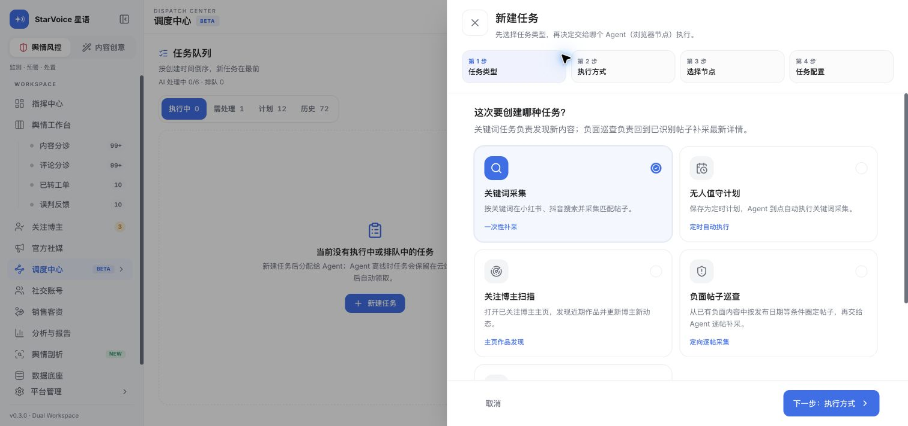
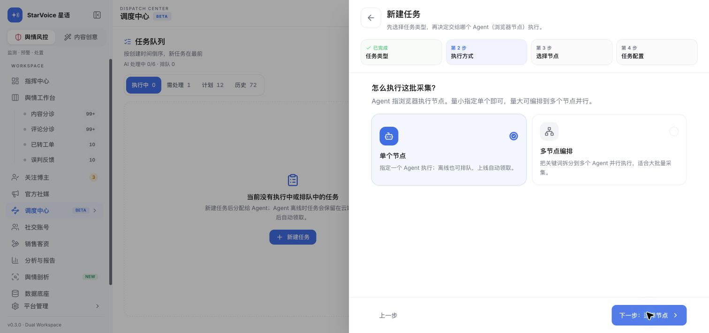
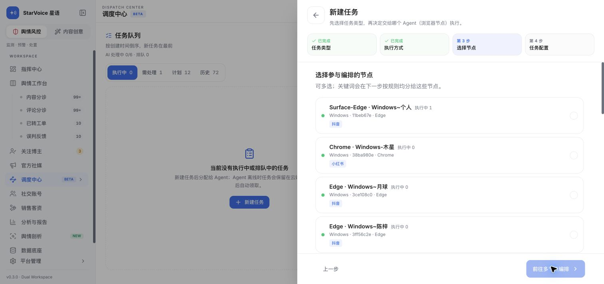
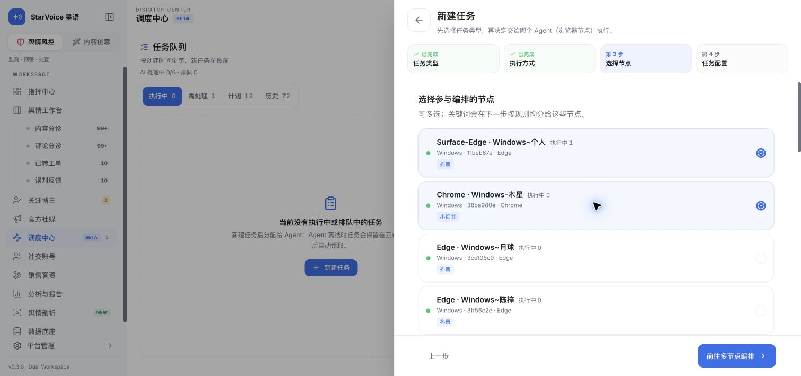
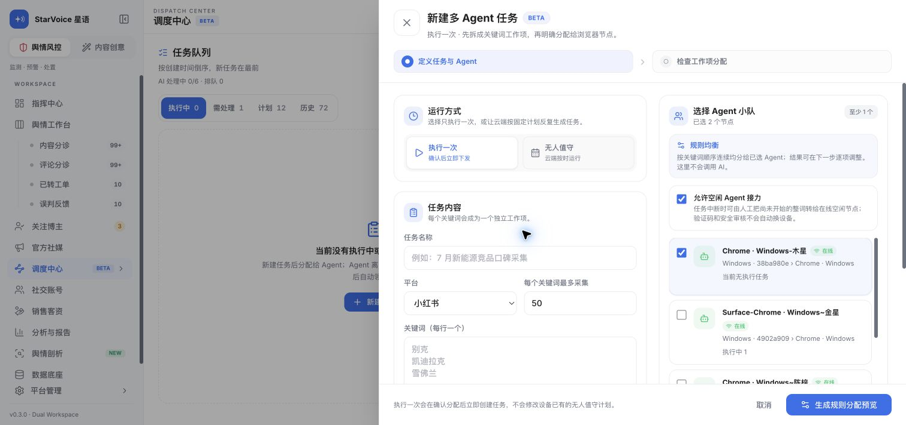
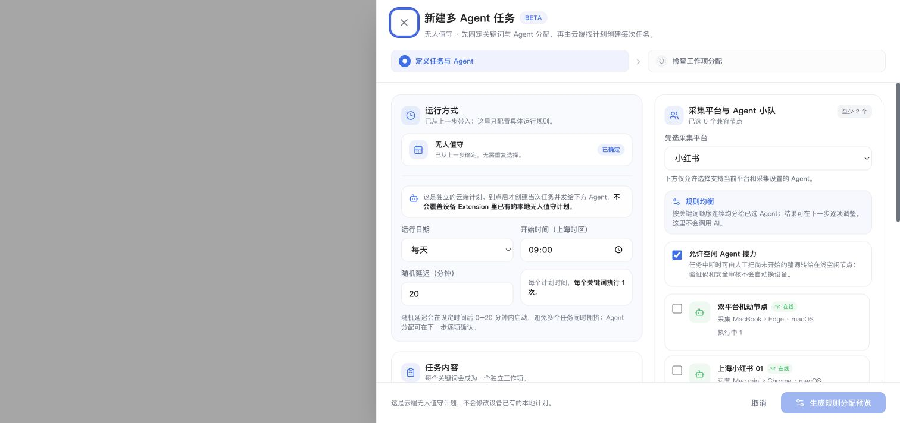
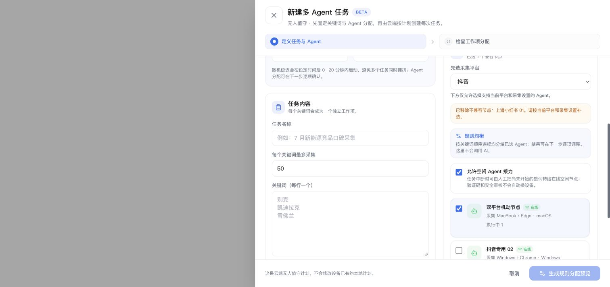

# 新建任务流程 UX 审计

日期：2026-08-03
范围：生产环境调度中心「新建任务 → 无人值守 → 多节点 → 混合平台节点 → 多 Agent 编排」

## 结论

当前问题不是单纯步骤多，而是两套创建器拼接后只传递了节点 ID：外层四步向导收集了无人值守和节点，进入多 Agent 编排器后又从默认的「执行一次 / 小红书」开始。节点兼容性也直到第二套创建器选择平台后才判断，因此前一步允许选择的节点会在后一步失效，并可能把“多节点”静默降为单节点。

建议不要继续给现有四步打补丁。通用「新建任务」应收敛为三步：

1. **任务内容**：选择业务类型；关键词任务在同一步确定运行方式、平台、关键词和采集规则。
2. **分配节点**：平台与能力已确定后，只展示完整兼容节点；选 1 个即单节点，选多个即多节点，不再单独询问一次“执行方式”。
3. **确认创建**：单节点显示最终摘要；多节点显示关键词分配预览。无人值守计划在这里确认排期。

「无人值守」应从任务类型移到运行方式；「单节点 / 多节点」应从单独步骤改为节点选择结果。通用入口中的无人值守建议统一为云端计划；设备本地计划保留在 Agent 详情入口，避免同名功能暗含两套完全不同的行为。

## 证据步骤

### 1. 任务类型 — 健康度：需重构

- 优点：业务卡片易扫读，选中态清楚。
- 问题：「无人值守计划」与关键词、巡查并列，但它实际是运行策略，不是业务类型。

### 2. 执行方式 — 健康度：冗余

- 已选无人值守后再次询问单/多节点，把“何时运行”和“由多少节点运行”都叫执行方式。
- 单/多节点无需独立一屏，可由节点选择数量自然决定。

### 3. 选择节点 — 健康度：顺序错误

- 平台尚未确定，抖音与小红书节点都可选。
- 多节点云端计划被错误套用了单设备本地计划的能力门槛。

### 4. 混合平台选择通过 — 健康度：高风险

- 1 个抖音节点 + 1 个小红书节点满足外层“至少 2 个”校验。
- 当前后端一个编排只支持一个平台，因此这组选择不可能按用户看到的方式执行。

### 5. 进入第二套创建器 — 健康度：阻断级

- 运行方式重置为「执行一次」，丢失前面选择的无人值守。
- 平台重置为「小红书」。抖音节点仍显示已选，但已被禁用；真正预览时只会使用兼容节点。
- 页面显示“已选 2 个”，实际有效节点只有 1 个，导致多节点静默退化成单节点。
- 四步进度在第 3 步后消失，替换成另一套两步进度，用户不能回到原向导修改。

## 优先级

### P0：先阻止错误结果

- 多节点交接必须保留已确定的 `executionMode`；平台和有效 `agentIds` 改在同一配置页按顺序选择，不再从前一步传一组尚未验证的平台混合节点。
- 平台必须先于节点确定；所有计数、摘要、预览和提交只使用同一份兼容节点集合。
- 多节点在平台过滤后仍必须至少 2 个；不足时明确阻断，不能静默降级。
- 平台变化移除节点时，用可见提示和 `aria-live` 告知移除了谁以及原因。

### P0 实施结果（2026-08-03）

- 多节点入口不再经过外层节点选择；进入任务配置后，平台选择固定在 Agent 小队顶部，先定平台，再选择兼容 Agent，小队只选一次。
- 外层选择的「无人值守」会被完整带入并锁定，不会回落成「执行一次」。
- 多节点在兼容性过滤后仍要求至少 2 个 Agent，且最终关键词分配必须实际覆盖至少 2 个 Agent；数量不足时禁用预览或确认。

- 切换平台会保留双平台节点、移除不兼容节点，并明确显示被移除的节点名称。
- 计数、选择态、预览请求统一使用兼容节点集合，避免界面显示 2 个、实际只提交 1 个。
- 这是不改后端契约的止错收口；下面的三步重构仍作为 P1，不在本次改动范围内。

### P1：收敛为三步

- 要做什么：关键词采集 / 博主扫描 / 负面巡查 / 官方评论巡查。
- 任务内容：运行方式、平台或账号、关键词、日期、增强规则。
- 分配并确认：只选一次节点；1 个为单节点，多个为多节点；必要时显示分配预览。

## 验收场景

- 无人值守 + 小红书 + 多节点：全流程摘要始终保持「无人值守 / 小红书 / 多节点」。
- 混合节点后切平台：明确移除不兼容节点；兼容节点不足 2 个时阻止继续。
- 单节点设备计划：只有这条路径要求设备支持本地计划写入。
- 多节点云端计划：不要求设备本地计划写入能力，但必须满足云端任务、平台和采集参数能力。
- 回退修改平台：保留仍兼容节点，并明确列出被移除节点；请求体不得残留失效 ID。

## 审计边界

本次在当前生产桌面流程中复现到第二套创建器，并用前端与后端契约核对了状态丢失机制。没有提交任务或生成分配草稿，避免改变生产数据；未覆盖移动端、缩放、完整键盘操作与读屏器实测，因此无障碍部分是风险判断，不是完整合规结论。
