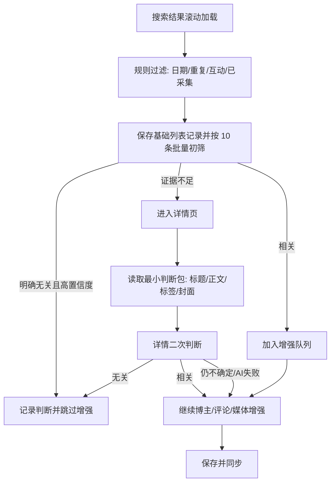

# StarVoice AI 前置相关性筛选实施规格

> 状态：已实施（Extension `0.3.46`），当前落地为列表文字阶段的保守真实跳过
>
> 适用版本基线：StarVoice Extension `0.3.46`
>
> 最后更新：2026-07-18
>
> 适用平台：小红书、抖音；后续可扩展微博
>
> 目标读者：产品、扩展开发、后端开发、测试，以及后续接手本仓库的 AI

> 部署边界：本文的“已实施”只表示仓库源码与 `0.3.46` 扩展能力已落地，不单独作为某个生产环境、租户策略或客户端已启用的证明。

## 1. 当前实施决策

在搜索页“采集增强”中提供默认关闭的 `AI 精准筛选` 选项。用户勾选后，手动采集和无人值守共用同一配置；扩展在打开任何详情工作页之前，将已保存的列表记录按关键词和平台分组，把标题、作者、类型和时间等必要文字交给后台 DeepSeek 批量判断。

当前 `0.3.46` 执行规则是：

1. 仅 `status=ok`、`modelDecision=skip`、后台允许 `skip_full_capture`、标题不是兜底文案，且置信度不低于 `0.97` 时，才真正跳过详情、评论和博主增强。
2. `keep`、`need_detail`、低置信度、兜底标题、缺项、超时、断网、限流、模型异常和无效输出一律安全放行，按原流程增强。
3. 真正跳过只省略昂贵增强，不删除列表阶段已保存的基础记录；记录卡片显示“AI 已判定无关 · 已跳过增强”，并显示关键词、置信度和跳过原因。
4. 扩展客户端每批 `10` 条、单批等待上限 `10s`、最多并发 `6` 批；服务端 DeepSeek 默认模型超时 `8s`，租户级默认并发上限同为 `6`。

本文其余章节保留影子验证、详情二筛、视觉复核和意图卡等历史设计与长期方向；除非明确标注“已落地”，不应把它们理解为 `0.3.46` 已实施功能。

## 2. 背景与问题

平台搜索结果并不严格服从用户输入的完整语义。例如搜索“别克壁纸”时，可能出现：

- 别克汽车、车标、车机或手机壁纸；
- 其他汽车品牌壁纸；
- 标题中偶然包含“别克”的人物、舞蹈或无关内容；
- 标题和封面无法判断，但正文、标签或视频内容实际相关的作品。

当前流程会先把搜索结果加入采集池，再逐条打开详情，采集正文、博主指标、评论等。后端 AI 最终可以把无关内容判为 `irrelevant`，但此时浏览器已经支付了详情导航、等待、评论滚动、主页访问和同步成本。

AI 前置的价值不是替代后端最终分析，而是尽早停止明显无意义的昂贵采集步骤。

## 3. 目标与非目标

### 3.1 目标

1. 提升“每分钟获得的有效相关作品数”。
2. 减少无关内容的详情、评论和博主主页访问。
3. 保持召回优先：证据不足时宁可继续采集，不得静默误杀。
4. 手动采集和无人值守使用同一套相关性能力与决策契约。
5. AI 超时、断网、模型不可用时，采集按原流程继续。
6. 让用户知道 AI 为什么跳过、为什么进入详情复核、节省了多少工作。

### 3.2 非目标

1. 不使用 Lingma Cloud Agent 或浏览器 Debug 逐条控制页面来判断相关性。
2. 第一版不对所有封面、视频或音频运行视觉/ASR 模型。
3. 不用列表页显示的 `comments = 0` 判断真实零评论。
4. 不在第一阶段删除或隐藏任何原本会被采集的数据。
5. 不把品牌相关性和本次关键词意图匹配混为一个结论。

### 3.3 历史第一期交付边界（保留作为设计记录）

> 以下内容是最初的影子模式设计，不是 `0.3.46` 当前运行方式。当前版本已进入列表阶段的保守真实跳过，详情 AI 二筛和视觉复核仍未落地。

为避免“第一期”被理解成不同范围，首个可交付版本固定为“阶段 0 + 阶段 1”，其中：

- 阶段 0 是上线前验证门槛，不进入扩展运行链路；
- 阶段 1 是运行时影子模式，只做列表页文字批量判断；
- 模型可以给出 `keep / skip / need_detail`，但实际处置一律为 `collect_full`；
- 手动采集和无人值守必须接入同一个共享编排契约；
- 保存判断、异常、耗时和假设节省量，状态栏明确提示“不会真正跳过”；
- 关闭 AI 与开启影子模式时，页面扫描、记录数量、详情访问、评论/主页增强和停止点必须完全一致。

第一期明确不包含：

- 真正跳过任何候选；
- 详情页 AI 二筛；
- 封面视觉、视频抽帧或 ASR；
- 为凑 AI 预测的相关数量而额外向下扫描；
- 修改现有关键词过滤、评论、博主或媒体增强行为。

详情二筛是总体目标能力，但只在阶段 3 实施；视觉只在阶段 4 实施。二者可以提前定义接口，不得在第一期暗中启用。

## 4. 两种“相关性”必须分开

现有后端 AI 主要判断内容是否属于租户的品牌监控范围。对于上汽通用租户，别克车型、别克壁纸、别克门店和别克相关活动都可能属于品牌相关。

但“别克壁纸”这次采集任务要求的是更窄的查询意图：

| 判断维度 | 问题 | 示例 |
|---|---|---|
| 品牌相关性 | 内容是否真的涉及别克汽车品牌 | 别克新车发布：相关 |
| 查询意图匹配 | 内容是否符合“别克壁纸”这一完整意图 | 别克新车发布但没有壁纸：不匹配 |

前置筛选必须独立输出这两个判断。查询意图匹配只决定当前关键词归因；只有查询意图明确不匹配、租户整体监测也明确无关且没有投诉、故障、救援等保护信号时，才允许跳过增强。后端最终舆情分析使用租户品牌背景与全部监测主题综合判断。

## 5. 当前可用信号

### 5.1 搜索列表阶段

| 信号 | 小红书 | 抖音 | 限制 |
|---|---|---|---|
| 作品 ID、URL | 有 | 有 | 抖音需保留搜索上下文链接，避免直达页失效 |
| 标题/卡片摘要 | 有 | 有 | 可能截断；抖音缺失时可能生成兜底标题 |
| 作者名、主页 URL | 有 | 有 | 适合识别人名噪声、官方账号、竞品账号 |
| 封面 | 有 | 有 | 适合灰区视觉复核，不建议全量传视觉模型 |
| 图文/视频类型 | 可推断 | 可推断；有时含时长 | 可作为提示词上下文 |
| 发布时间 | 有，中等可靠 | 有，中等可靠 | 时间范围优先使用规则过滤 |
| 互动指标 | 只保证当前展示/排序维度 | 主要是点赞 | 未展示字段可能只是 `0` 占位 |
| 正文、话题标签 | 无 | 无 | 必须进入详情 |
| 评论正文、粉丝数 | 无 | 无 | 属于昂贵增强，不应参与列表初筛 |

代码锚点：

- 小红书列表解析：`utils/capture/keyword-search.js#extractNoteCards`
- 抖音列表解析：`utils/capture/douyin-keyword-search.js#extractDouyinSearchCards`

### 5.2 详情阶段

详情页可以补充：

- 完整标题、正文、话题标签；
- 更可靠的作者与发布时间；
- 完整互动数据；
- 封面、图片列表或视频基础信息；
- 后续可选的博主指标、评论、客资与媒体信息。

AI 二次判断应发生在“标题、正文、标签已取得”之后，“评论和博主主页增强”之前。

当前主要编排位于：`utils/capture-sync.js#batchCaptureDetailsForRecords`。

## 6. 总体流程

`0.3.46` 已落地的路径是：确定性列表规则 → 保存基础列表记录 → 每批 10 条的 DeepSeek 列表文字判断 → 高置信度明确无关项标记为已过滤并跳过增强 → 其余项进入原详情增强流程。下图是包含未来详情二筛的目标架构，其中详情 AI 复核仍是后续项。



设计原则：不确定、超时和错误全部 `fail open`，即继续原采集流程。

## 7. 关键词意图卡（后续项）

`0.3.46` 当前由服务端结合搜索关键词和租户品牌上下文生成判断提示，尚未提供本节设计的可编辑意图卡 UI 和独立意图解析接口。

### 7.1 为什么需要

用户不应为每个关键词手写复杂提示词。系统应在关键词首次运行时生成一张可复用、可编辑的意图卡，并保存版本。

### 7.2 示例

```json
{
  "intentId": "intent_uuid",
  "keyword": "别克壁纸",
  "intentVersion": 1,
  "targetEntity": ["别克汽车", "Buick"],
  "targetContent": ["手机壁纸", "电脑壁纸", "车机屏保", "车型或车标壁纸"],
  "includeSignals": ["别克车型", "别克车标", "Buick", "壁纸", "屏保", "高清图"],
  "excludeSignals": ["其他汽车品牌", "同名人物", "舞蹈", "泛壁纸但无别克"],
  "detailPolicy": "evidence_insufficient",
  "userNote": "只要能作为壁纸使用的别克相关图片或视频素材"
}
```

### 7.3 默认交互

任务设置中只增加一个简洁入口：

- 开关：`AI 精准筛选`；
- 策略：`影子验证 / 保守 / 平衡`，默认影子验证；
- 摘要：显示系统理解，例如“寻找别克汽车壁纸，排除其他品牌及同名无关内容”；
- 高级编辑：保留项、排除项、补充说明。

关键词意图应按“租户 + 平台 + 关键词 + 意图版本”缓存。用户修改意图后必须产生新版本，旧判断不得继续复用。

### 7.4 意图卡生命周期

1. 服务端以“租户 + 平台 + 标准化关键词”解析意图卡，并分配全局唯一 `intentId`。
2. 同一 `intentId` 的 `intentVersion` 单调递增；不能让不同关键词各自的 `version=1` 被当成同一个意图。
3. 建议提供 `POST /api/relevance/intents/resolve` 完成读取或首次生成，提供带 `expectedVersion` 的更新接口；并发编辑版本不一致时返回 `409 INTENT_VERSION_CONFLICT`。
4. 任务开始时保存意图卡完整快照：`intentId + intentVersion + card + promptVersion`。运行途中即使用户编辑意图，当前关键词仍使用原快照，下一个新任务才使用新版本。
5. 无人值守切换到下一个关键词时重新解析该词的意图快照，不能沿用上一个词的卡片或统计。
6. 首次生成失败、服务不可用或意图卡字段不完整时，不阻塞任务；第一期记录 `intent_unavailable` 并按原流程采集。
7. 用户编辑、恢复跳过项或确认无关只形成可审计样本；生产意图和提示词必须通过显式版本发布，不能在线静默漂移。

意图卡建议由服务端持久化。扩展只保存当前任务快照和短期只读缓存，不把浏览器本地存储作为意图事实源。

## 8. 决策契约

### 8.1 三态结果

```json
{
  "itemId": "platform:external_id",
  "modelDecision": "keep|skip|need_detail|null",
  "decisionFinality": "provisional|final|null",
  "executionDisposition": "collect_full|collect_detail_minimal|skip_expensive|sample_full",
  "queryMatch": 0.0,
  "brandMatch": 0.0,
  "tenantRelevance": "relevant|irrelevant|uncertain|null",
  "protectedSignal": false,
  "confidence": 0.0,
  "reason": "标题明确是大众汽车壁纸，与别克壁纸意图不符",
  "evidence": ["标题: 大众GTI壁纸", "作者: 大众车友会"],
  "missingSignals": ["正文", "标签", "封面视觉"]
}
```

`modelDecision` 与 `executionDisposition` 必须分开：前者是模型在有限证据下的建议，后者才是采集器此刻允许执行的动作。例如影子模式可以得到 `modelDecision=skip`，但必须写成 `executionDisposition=collect_full`。

只有 `status=ok` 时，`modelDecision / decisionFinality / queryMatch / brandMatch / tenantRelevance / confidence` 才是必填模型字段。`protectedSignal` 由服务端规则补充。`ai_failed / ai_timed_out / invalid_input` 等非成功状态中，模型字段必须为 `null` 或省略；`executionDisposition` 仍必填且只能安全放行。校验器不得因模型字段为空而丢弃故障审计记录。

处置映射：

| 阶段/模式 | 模型结果 | 实际处置 |
|---|---|---|
| 当前保守列表筛选 | 高置信度 `skip`、`tenantRelevance=irrelevant`、整体匹配分足够低、无保护信号，且服务端返回 `skip_full_capture` | 保留基础列表记录，执行 `skip_expensive` |
| `0.3.46` 当前保守列表筛选 | `keep / need_detail / 低置信度 / 兜底标题 / 任何失败` | `collect_full` |
| 第一期影子模式 | 任意结果、超时或错误 | `collect_full` |
| 阶段 2 保守列表筛选 | 高置信度 `skip` 且未被抽检 | `skip_expensive` |
| 阶段 2 保守列表筛选 | 高置信度 `skip` 且被抽检 | `sample_full` |
| 阶段 2 保守列表筛选 | `keep / need_detail / 失败` | `collect_full`，此阶段没有 AI 详情二筛 |
| 阶段 3 详情二筛 | 列表 `need_detail` | `collect_detail_minimal` |
| 阶段 3 详情二筛 | 详情 `keep / need_detail / 失败` | `collect_full` |
| 阶段 3 详情二筛 | 详情高置信度 `skip` | `skip_expensive`，但保留已读取的最小判断包 |

### 8.2 候选执行状态机

每个“关键词运行 + 候选 + 判断阶段”独立维护状态：

```text
discovered
  -> rule_rejected | rule_passed
  -> ai_queued
  -> ai_inflight
  -> ai_resolved | ai_failed | ai_timed_out
  -> disposition_ready
  -> collecting | skipped | sampled
  -> stored | failed | cancelled
```

约束：

- `ai_failed / ai_timed_out` 只能产生安全放行处置，不能产生 `skipped`；
- 影子模式的 AI 状态可以异步落账，但不得改变候选原有执行状态；
- 同一候选在不同关键词下可以有不同语义判断，因此去重键必须包含 `keywordRunId`；
- 抽检在模型作出高置信度跳过结论后再随机决定，避免样本选择偏差；
- `decisionFinality=provisional` 的列表判断不能被统计成“最终有效相关”。

### 8.3 推荐阈值

| 模式 | 列表页自动跳过条件 | 灰区处理 |
|---|---|---|
| 影子验证 | 从不真正跳过 | 全部按原流程采集 |
| 保守 | `modelDecision=skip` 且校准阈值初始不低于 `0.97` | 阶段 2 按原流程完整采集；阶段 3 才进入 AI 详情复核 |
| 平衡 | 待影子数据校准，初始不得低于 `0.90` | 未完成阶段 3 验收前仍按原流程完整采集 |

以下情况强制 `keep` 或 `need_detail`：

- AI 超时、接口错误或模型不可用时不伪造模型判断，实际处置直接 `collect_full`；
- 标题是系统兜底标题；
- 只有封面可能包含关键证据；
- 视频只能通过画面或口播判断；
- 模型输出缺字段、JSON 无法解析；
- 模型认为品牌相关与查询意图存在冲突但理由不足。

## 9. 后端接口建议

新增租户鉴权的批量接口：

`POST /api/relevance/prefilter`

### 9.1 请求

```json
{
  "requestId": "req_uuid",
  "idempotencyKey": "keyword_run:stage:batch_sequence:content_hash",
  "platform": "xiaohongshu",
  "stage": "list|detail",
  "keyword": "别克壁纸",
  "promptVersion": "prefilter-list-v3",
  "intent": {
    "intentId": "intent_uuid",
    "intentVersion": 1,
    "targetEntity": ["别克汽车", "Buick"],
    "targetContent": ["壁纸", "屏保"]
  },
  "items": [
    {
      "itemId": "xiaohongshu:abc",
      "title": "别克世纪高清车机壁纸",
      "author": "别克车友",
      "noteType": "image",
      "publishTime": "1天前"
    }
  ]
}
```

上例是第一期 `stage=list` 的完整字段边界，不发送 `coverUrl / content / tags`。阶段 3 的详情请求才可增加截断正文与标签；阶段 4 且租户明确启用视觉后才可增加封面字段。

### 9.2 响应

```json
{
  "ok": true,
  "requestId": "req_uuid",
  "intentId": "intent_uuid",
  "promptVersion": "prefilter-list-v3",
  "intentVersion": 1,
  "model": "qwen-or-deepseek-model-name",
  "latencyMs": 826,
  "items": [
    {
      "itemId": "xiaohongshu:abc",
      "status": "ok",
      "modelDecision": "keep",
      "decisionFinality": "provisional",
      "queryMatch": 0.99,
      "brandMatch": 0.99,
      "tenantRelevance": "relevant",
      "protectedSignal": false,
      "confidence": 0.98,
      "reason": "标题同时命中别克车型与壁纸用途",
      "evidence": ["别克世纪", "车机壁纸"],
      "missingSignals": []
    }
  ]
}
```

### 9.3 后端约束

1. 复用现有租户 AI 提供商、模型、Key、品牌别名、业务语境和噪声词配置。
2. 不直接复用现有 `labelRecord()`：它是采集后逐条标注，单次超时可达 40 秒，且判断范围偏品牌级。
3. 列表接口批量处理：服务端契约最多接受 40 条，`0.3.46` 扩展实际每批发送 10 条。
4. 详情接口可以使用较小批次，但仍应合并同一时间窗口内的请求。
5. 加租户级并发限制、每日额度、超时、熔断和降级。
6. AI 调用不得持有数据库事务。
7. 服务端返回失败时，扩展不得中止采集。

### 9.4 批量接口完整契约

初始限制固定如下，后续可以经压测调整但必须版本化：

- 列表接口最多接收 40 条，`0.3.46` 扩展为提高 DeepSeek 响应稳定性固定每批 10 条；空数组或重复 `itemId` 视为整批请求错误；
- 扩展不得依赖响应顺序，必须按 `itemId` 映射；
- 成功响应必须对每个唯一 `itemId` 返回且只返回一项；缺项、多项、未知项或非法字段按该项 `model_error` 处理并安全放行；
- 同一 `idempotencyKey + requestBodyHash` 重试返回同一逻辑结果；同键不同请求体返回 `409 IDEMPOTENCY_CONFLICT`；
- `0.3.46` 扩展单批等待上限为 10 秒，服务端 DeepSeek 默认超时为 8 秒；任一超时均安全放行，不得生成跳过处置；
- 扩展同一关键词最多并发 6 个批次，服务端默认租户级同时调用上限为 6；
- 服务端允许部分成功。单项状态为 `ok / invalid_input / model_error / timeout`，只有 `status=ok` 且字段完整时才允许生成模型建议；
- 服务端必须回显 `requestId / intentVersion / promptVersion / model`，便于审计和缓存校验。

HTTP/业务错误建议：

| 场景 | 响应 | 扩展行为 |
|---|---|---|
| 请求结构非法、重复 ID、批次超限 | `400/413/422` | 整批 `ai_failed`，全部放行 |
| 未登录或无租户权限 | `401/403` | 整批放行，并停止本任务后续 AI 请求 |
| 意图版本不存在或冲突 | `409 INTENT_VERSION_*` | 放行；下一个新任务重新解析意图 |
| 租户额度或并发受限 | `429` | 放行；按服务端退避时间暂停 AI，不暂停采集 |
| 模型不可用、服务熔断 | `503` | 放行；切换到服务端要求的影子/关闭状态 |
| 200 但单项失败 | 单项 `status != ok` | 仅该项放行，其他成功项照常记录 |

重试必须复用幂等键，且不能绕过 `0.3.46` 的 10 秒客户端边界；失败后不得因等待 AI 而阻塞详情增强。

### 9.5 数据最小化与用户告知

- 第一期只发送判断所需的标题、作者、类型、时间等列表文字字段，不发送 Cookie、登录令牌、评论、客户信息或无关页面内容；
- 正文只在阶段 3 的详情二筛中发送，且按长度截断、去除页面脚本与跟踪参数；
- 封面 URL 或图像只在阶段 4 且租户启用视觉时发送；默认不得把受登录保护的媒体 URL 交给第三方模型；
- 服务端日志默认记录哈希、长度、模型版本与决策，不长期记录完整正文；具体保留期由租户数据策略决定；
- UI 应说明“AI 精准筛选会把作品标题等必要信息发送到当前租户配置的 AI 服务商”；供应商、地域或保留策略变更时应重新告知；
- 选择的 AI 供应商必须服从现有租户模型配置和数据处理约束，不能由扩展私自调用另一个公共模型。

## 10. 并发、缓存与性能

### 10.1 页面滚动与 AI 并行

> 实施说明：本节的“滚动过程中流式判断”是后续性能目标。`0.3.46` 当前是列表采集并保存基础记录后、打开详情工作页前，以 10 条为一批、最多 6 批并发判断。

列表采用流式分批，不等待“完整列表”才开始判断：

1. 页面继续滚动并解析卡片；
2. 候选先经过日期、重复、互动阈值等确定性规则；
3. 目标架构中，规则通过的候选进入批次缓冲区；当前扩展固定按 10 条分批；
4. AI 在途期间继续滚动，不能每发现一张卡片就暂停等待；
5. 滚动结束或页面持续无新增时，把不足一批的尾部候选立即冲刷；
6. 结果按候选发现序号附着，不能因为批次响应乱序而打乱用户看到的记录顺序。

列表采集结束时：

- 已有判断的候选立即分流；
- 尚未完成的批次只等待一个很短的预算；
- 超过预算的候选记录 `modelDecision=null / ai_timed_out / executionDisposition=collect_full`；不得伪造为模型判断 `keep`。

推荐首期预算：

- 列表批次目标 P95：2 秒以内；
- 扩展额外等待预算：不超过 2–3 秒；
- 详情判断超时后立即继续增强。

第一期影子模式完全不等待 AI 才进入原详情队列，最多只在任务收尾等待 2–3 秒补齐审计结果。阶段 2 真正筛选时，已完成批次可以边返回边分流；列表结束后尚未完成的候选在等待预算到期即安全放行。不存在“整轮列表完成后再统一阻塞判断”的路径。

### 10.2 缓存键

```text
tenantId
+ platform
+ stage
+ normalizedKeywordHash
+ intentId
+ externalId
+ intentVersion
+ contentSummaryHash
+ promptVersion
+ modelProvider
+ modelName
```

缓存规范：

- `normalizedKeyword` 使用 Unicode NFKC、去首尾空白、合并连续空格，拉丁字母转小写；缓存中保存其哈希，不保存为日志主键；
- `contentSummaryHash` 是阶段相关字段的稳定 JSON 做 SHA-256：列表含标题、作者、类型和标准化时间，详情另含正文、标签；字段顺序必须固定；
- 默认 TTL 为 14 天，仅缓存字段完整的 `status=ok`；超时、非法输出、权限、限流或模型错误不得缓存为语义判断；
- 意图、提示词、模型、判断阶段或证据变化会自然生成新键；服务端仍需支持按租户、`intentId`、`promptVersion` 主动失效；
- 相同键的在途请求合并，避免手动和无人值守或重试造成重复计费；
- 缓存只复用 `modelDecision`，`executionDisposition` 必须依据当前功能开关、模式和抽检策略实时重算。

### 10.3 视觉策略

阶段 1 至阶段 3 只用文字。阶段 4 中，以下情况才进入视觉复核：

- 关键词天然依赖视觉，例如壁纸、车标、车型外观、穿搭、包装；
- 标题和作者证据不足；
- 封面可用且不需要访问受限媒体地址。

视觉也只对灰区执行。若图片无法加载或模型失败，继续详情/原采集，不得跳过。

视频前置阶段不全量运行 ASR。若标题、正文、标签和封面仍不足，首期保守采集；后续再评估首帧/抽帧/短 ASR。

## 11. 与现有采集链路的结合

### 11.1 共享能力，而不是复制流程

相关性预筛必须位于共享采集编排层，由以下入口共同调用：

- 手动搜索页批量采集；
- 无人值守多关键词计划；
- 后续可能的精确补采任务。

无人值守只负责计划、恢复和进度；不得实现另一套 AI 判断逻辑。这样可以避免“手动正常、无人值守行为不同”的再次发生。

共享模块至少提供以下契约，名称可调整，语义不可拆成两套：

```text
createRelevanceRunContext(taskSnapshot) -> runContext
enqueueListCandidates(runContext, candidates) -> immediateRuleResults
flushListPrefilter(runContext, reason) -> batchSummary
evaluateDetailEvidence(runContext, evidence) -> decisionResult   // 阶段 3 才启用
finalizeKeywordRun(runContext, stopReason) -> immutableKeywordSummary
```

`runContext` 必须包含：

- `taskId / runId / keywordRunId`；
- `entryMode = manual | unattended`，只用于审计，不能改变语义判断；
- `platform / keyword / keywordIndex / keywordCount`；
- 完整 `intentSnapshot` 与 `promptVersion`；
- `requestedMode / effectiveMode / featurePolicyVersion`；
- 目标口径、扫描预算、批次序号和候选发现序号。

一致性与恢复规则：

1. 去重键为 `keywordRunId + platform + externalId + stage`；同作品跨关键词必须分别判断，不能错误共用统计。
2. 手动采集也创建标准 `keywordRunId`，只是通常只有一个词；无人值守仅循环创建上下文、调用同一共享函数、等待终态后进入下一词。
3. 每个关键词的统计独立落账，再汇总到任务级；UI 的 `3/13` 来自 `keywordIndex/keywordCount`，不能用作品进度代替。
4. 持久化意图快照、最后确认批次序号、已完成决策和最终摘要。扩展重载后，原 `ai_queued / ai_inflight` 统一转为 `ai_timed_out` 并安全放行；影子元数据可用同幂等键补请求，但不得阻塞恢复。
5. 关键词终态生成后，迟到响应只能补该词审计，不得修改下一个词的进度、计数或执行队列。
6. 同一输入若 `intentVersion / promptVersion / content hash` 一致，手动与无人值守应得到同一模型建议；处置差异只能来自显式模式或抽检随机结果。

### 11.2 列表阶段建议插入点

平台列表模块仍只负责解析页面和提供稳定候选字段。共享编排在滚动过程中持续把“规则通过且未入队”的候选交给 `enqueueListCandidates()`；达到批次阈值立即异步判断，结束时通过 `flushListPrefilter()` 冲刷尾批。

确定性规则与现有关键词过滤不得被 AI 替代：

- 日期、重复、已增强、互动阈值等确定性规则先运行；
- 第一、二阶段保留现有详情关键词过滤及其顺序，作为回归基线；
- 阶段 3 实施时，可以把完全确定的关键词规则前移到详情 AI 之前，但必须通过行为回放证明没有改变原有应保留内容；
- AI 只处理语义灰区，不得用一个不透明模型结果覆盖明确的用户规则。

影子模式下不得改变现有记录列表，只附加判断元数据。

### 11.3 详情阶段建议插入点

现有详情流程大致是：

1. 打开详情；
2. 读取作品正文与基础数据；
3. 补博主指标；
4. 运行关键词过滤；
5. 采评论；
6. 更新本地记录并同步。

目标顺序应调整为：

1. 打开详情；
2. 读取最小判断包；
3. AI 详情二筛；
4. 无关则记录判断并结束当前条；
5. 相关或不确定则继续博主指标、评论与媒体增强；
6. 更新并同步。

详情二筛不得为了 AI 再次关闭、重开同一详情页。

详情最小判断包的最低要求：

- 已验证当前详情身份与目标 `externalId` 一致；
- 保存原关键词、意图快照与列表判断；
- 至少取得标题、正文、标签三类语义信号中的一类，且不能只是系统兜底标题；
- 作者、作品类型、准确时间作为可选辅助字段；
- 第一至三阶段不要求视觉或 ASR 才能做安全决定。

若身份无法验证、语义字段均为空、页面受限或只能通过视频口播判断，直接 `collect_full`，不能为了等 AI 卡住当前详情。阶段 2 的灰区也全部走现有完整增强，不运行详情 AI。

## 12. “目标 50 条”的语义

“列表判断相关”“故障后安全放行”和“最终确认符合查询意图”不是同一件事，不能都显示为“有效相关”。固定使用以下计数：

| 计数 | 严格定义 | 用途 |
|---|---|---|
| `discoveredUniqueItems` | 当前关键词下看到且可取得稳定平台 ID 的唯一卡片；重复卡片不再计数，之后即使被日期规则拒绝也仍算已扫描 | 扫描预算分母 |
| `retainedCandidates` | 未被规则或 AI 跳过、且成功保存的唯一作品；包含 AI 失败后的安全放行项 | 阶段 2 可实现的“保留作品”口径 |
| `verifiedRelevantItems` | 去重、保存成功，且详情或完整内容的最终查询意图结论为 `keep` | 才能对用户称为“有效相关” |
| `failOpenItems` | 因超时、异常、证据不足而安全放行的作品 | 单独展示，不冒充最终相关 |

分阶段语义：

1. 第一期影子模式继续使用当前版本原有的采集上限与停止逻辑，绝不为 AI 多扫；AI 数字只做旁路统计。
2. 阶段 2 若开启保守跳过，默认 UI 应叫“目标保留作品数”，使用 `targetRetainedCandidates`。这提高命中概率，但不能承诺每条最终相关。
3. 只有阶段 3 或后续拥有最终查询意图结论时，才允许提供严格的“目标有效相关数”，使用 `targetVerifiedRelevantItems`；列表临时 `keep` 和安全放行项不得提前计入完成。

扫描预算 `maxScannedItems` 按 `discoveredUniqueItems` 计算，建议默认是目标数的 2–3 倍，再按真实命中率校准。缓存命中照常计为一次已扫描候选；重复项不计；抽检项若最终相关且保存成功，可计入相应最终目标。

停止条件：

1. 达到当前任务明确选择的目标口径；或
2. 达到 `maxScannedItems`；或
3. 页面持续无新增；或
4. 用户停止、验证码、安全限制或平台风控。

未达到目标时必须返回明确终态，例如：`部分完成：最终相关 37/50；已扫描 150/150，因达到扫描预算停止`，不能表现为突然结束或笼统“已完成”。

## 13. 决策留痕与恢复

自动跳过不能等于彻底消失。每个判断至少保留：

- 平台、作品 ID、URL 哈希，以及数据策略允许的标题/作者必要摘要；封面只在阶段 4 启用视觉后保存其判断证据；
- 关键词与意图版本；
- 判断阶段：列表/详情；
- `modelDecision / decisionFinality / executionDisposition`、置信度、原因、证据；
- 模型与提示词版本；
- 判断时间、耗时、是否命中缓存；
- 是否被抽检、人工恢复或人工确认无关。

建议阶段：

1. 影子模式即建立服务端任务级轻量决策台账，不依赖作品最终是否成功保存；API 服务端判断和扩展本地超时/失败终态都必须能进入台账。
2. 已保存作品可以镜像最近判断到 `payload.prefilterDecisions[]`，但不得使用会互相覆盖的单值 `payload.prefilterDecision`。
3. 真正跳过阶段继续复用同一台账，避免为了留痕而创建完整舆情记录。
4. UI 提供“查看 AI 跳过项”和“恢复采集”。

台账唯一键至少包含：

```text
tenantId + taskId + runId + keywordRunId
+ platform + externalId + stage
+ intentVersion + promptVersion + requestId
```

每次判断同时保存 `serverModelStatus` 与 `clientExecutionStatus`。客户端已超时后到达的模型结果标记为 `late_result`，只能追加审计事件，不能覆盖原 `ai_timed_out / collect_full` 处置。这样同一作品跨关键词、跨任务、重试或迟到响应均不会互相覆盖。

服务端批量接口可直接持久化模型侧结果；客户端超时、断网和实际处置通过任务进度事件或独立审计事件接口幂等同步。台账只保存必要摘要、哈希和决策字段，服从 9.5 的数据最小化要求。

用户恢复采集或确认无关的操作，应作为该租户、该关键词的正反例，但不得直接在线修改生产提示词；先进入可审计的样本库。

## 14. 用户体验与状态栏

`0.3.46` 已落地的最小可见闭环包括：任务进度显示“AI 正在判断搜索结果相关性”及本批完成/跳过数；被跳过记录的卡片显示“AI 已判定无关 · 已跳过增强”，并列出关键词、置信度和判断原因。下面的队列、节省时间、恢复采集等更完整交互仍是后续项。

不要继续使用笼统的“正在补采”。建议显示：

```text
真正跳过模式
当前关键词：别克壁纸（3/13）
已发现 73 条
相关 22｜明确无关 31｜需看详情 20
正在复核第 8/20 条：标题证据不足，读取正文后再判断
本轮已减少 31 次完整增强，预计节省约 9 分钟
```

状态栏必须回答用户此刻最关心的五个问题：正在做什么、处理到哪里、系统是否还活着、还会等多久、为什么结束。

建议固定展示：

- 当前阶段：`滚动发现 / AI 批量判断 / 详情复核 / 完整增强 / 同步 / 风控暂停`；
- 关键词：`别克壁纸（3/13）`，以及本词作品进度，两个分母不得混用；
- 目标与预算：`目标保留 22/50｜已扫描 73/150`；严格相关模式则明确写 `最终相关`；
- 队列：`AI 在途 1 批｜待详情 20｜已增强 22｜安全放行 2`；
- 心跳：轻量呼吸灯、运行计时、当前步骤计时、`最近进展 6 秒前`、`最多再等 2.5 秒后安全继续`；
- 数字属性：异步列表判断期间标为“暂定”，关键词终态后才标为“最终”。

呼吸灯只用 CSS 动画和每秒一次计时文本更新，不截图、不轮询页面 DOM，不应给采集线程增加可感知负担。超过当前步骤等待预算时，状态必须从“处理中”变为“正在安全放行/重试 1/1/等待人工验证”，不能继续制造卡住感。

单条状态示例：

- `列表判断相关：标题同时命中“别克”和“壁纸”`；
- `进入详情复核：封面可能相关，但标题证据不足`；
- `详情判断无关：正文为大众车型壁纸`；
- `AI 超时，已按安全策略继续采集`。

影子模式必须明确提示：`AI 正在验证判断准确率，本轮不会真正跳过内容`。

终态必须区分：

- `完整完成`；
- `部分完成：达到扫描预算/页面无新增`；
- `已安全降级完成：AI 不可用，按原流程采集`；
- `等待处理：验证码/登录/风控`；
- `用户停止`；
- `异常终止`，并给出可恢复动作。

真正跳过模式可以显示“已减少 31 次完整增强”。影子模式只能显示“若开启保守模式，预计可减少 31 次完整增强”；预计节省时间使用同平台、同增强配置的历史中位耗时计算，并标注为估算，不能伪装成已节省的真实时间。

## 15. 上线阶段（历史路线与后续验收）

`0.3.46` 的仓库实现对应“阶段 2：保守列表初筛”的核心执行路径，但未实现本章全部后续能力；本章也不声明任何生产租户已开启该策略。

### 阶段 0：离线验证

- 从已完整采集且已有后端 AI/人工判断的数据中抽样；
- 模拟只使用列表字段时的判断；
- 计算高置信度 `skip` 的误杀率；
- 不接入采集主链路。
- 以“完整内容的查询意图人工真值”为基准；现有品牌级 AI 标签只能作参考，不能直接充当真值。

### 阶段 1：影子模式

- 扩展实时调用前置判断；
- 记录建议，但不跳过；
- 与完整采集后的结论及人工抽检比对；
- 状态栏展示“如果开启保守模式，本轮可少增强多少条”。
- 仅运行列表文字判断；不做详情 AI、视觉或额外扫描。
- 与关闭 AI 的对照运行必须具有完全相同的采集处置和停止点。

### 阶段 2：保守列表初筛

- 只跳过置信度不低于 0.97 的明确无关项；
- 5%–10% 跳过项随机继续采集作为抽检；
- 灰区全部进入现有详情和完整增强流程，此阶段不做详情 AI 二筛；
- 提供恢复入口。

### 阶段 3：详情二次筛选

- 在评论和主页增强前执行；
- 详情无关即停止后续昂贵步骤；
- 相关、不确定、失败均继续增强。
- 此阶段才启用 `collect_detail_minimal`，并可提供严格的“最终相关”目标口径。

### 阶段 4：按需视觉与意图学习

- 只处理文本灰区；
- 保存用户纠错样本；
- 按租户、关键词类型校准阈值；
- 未经回放验证，不自动调整生产阈值。

## 16. 成功指标

### 16.1 阶段 1 影子模式指标

影子模式不真正跳过，因此不以提速或减少访问作为验收目标：

| 指标 | 阶段 1 目标 |
|---|---:|
| 关闭 AI 与影子模式采集行为差异 | 0 |
| AI 故障时原采集流程成功继续率 | 功能验收 100%；生产 SLO 不低于 99.9% |
| AI 候选审计终态覆盖率 | 100% 为已判断、失败或超时之一 |
| 列表批次 P95 / 任务收尾额外等待 | 不高于 2 秒 / 不高于 3 秒 |
| 高置信度建议跳过项的人工真值安全门槛 | 按 16.4，单侧 95% 误杀率上界低于 1% |

### 16.2 阶段 2/3 真实收益指标

| 指标 | 开启真实筛选后的目标 |
|---|---:|
| 每分钟有效相关作品数 | 相比同条件现状提升至少 30% |
| 高置信度跳过项人工抽检误杀率 | 单侧 95% 上界持续低于 1% |
| 可执行高置信度跳过项避免完整增强率 | 除抽检、恢复外为 100% |
| 可执行高置信度跳过项避免评论/主页访问率 | 除抽检、恢复外为 100% |

### 16.3 诊断指标

- 列表阶段 `keep / skip / need_detail` 比例；
- 详情二筛的转化率；
- 灰区比例；长期超过 30%–40% 时，应优化意图卡或证据；
- AI 请求数、批次大小、P50/P95 延迟、超时率；
- 缓存命中率、Token/费用；
- 各关键词、平台和模型的误杀率；
- 每轮节省的详情、评论和主页访问数；
- 扫描数量与最终有效数量。

### 16.4 统计口径与上线门槛

1. “每分钟有效相关作品数” = `verifiedRelevantItems / 任务活跃分钟`。对照必须使用同平台、同关键词、同时间范围、同增强配置和近似页面供给；验证码等明确人工等待单独报告。
2. “误杀率” = 人工真值为相关、但被高置信度建议跳过的数量 / 被人工审计的高置信度建议跳过数量。真值依据完整标题、正文、标签和必要媒体，由两人独立判断；有争议时第三人裁决。
3. 影子模式准入保守跳过不能只看点估计。每个平台、主要关键词类型均需分层抽样，使误杀率的单侧 95% 置信上界低于 1%；例如某一关键分层约 300 条高置信度建议跳过样本且 0 条误杀，才接近该门槛。
4. `confidence=0.97` 不是天然准确率，只是候选阈值。必须用真实样本校准；模型、提示词、意图生成逻辑或主要页面字段变化后，重新进入影子验证。
5. 滚动抽检的单侧 95% 上界超过 1%、关键分层样本不足、分布漂移明显或 AI 故障放行率异常时，服务端自动把对应平台/关键词类型降级为影子模式。
6. “有效作品/分钟提升 30%”按相同条件 A/B 或交错对照计算；同时报告 AI P95 延迟、模型费用和额外等待，避免用省访问换来更高总耗时。
7. “预计节省时间” = 实际避免的步骤数 × 该平台/配置最近 30 天对应步骤的中位耗时，只作估算；真实任务总耗时另行记录。

## 17. 验收测试矩阵

### 17.1 语义案例

以“别克壁纸”为例至少覆盖：

1. 标题明确是别克车机壁纸 → `keep`；
2. 大众汽车壁纸 → 高置信度 `skip`；
3. 标题含“别克”但为同名人物舞蹈 → `skip`；
4. 标题“分享一组高清壁纸”，封面是别克 → `need_detail` 或视觉复核，不得直接跳过；
5. 标题看似无关，正文标签明确是别克壁纸 → 详情二筛 `keep`；
6. 别克汽车销售内容但没有壁纸 → 查询意图不匹配；
7. 视频仅靠口播才能确认 → 首期 `keep/need_detail`，不得误杀；
8. 标题为抖音兜底标题 → `need_detail`；
9. AI 返回非法 JSON → 原流程继续；
10. AI 超时/断网 → 原流程继续。

### 17.2 流程案例

1. 手动采集与无人值守对同一候选得到同样判断；
2. 无人值守切换关键词后使用对应意图版本；
3. 13 个关键词的进度与每个词的筛选统计正确；
4. 空结果关键词不终止整批计划；
5. 列表 AI 仍在运行时页面继续滚动；
6. 超时批次不阻塞详情队列；
7. 详情二筛后不会重复打开作品；
8. 被跳过项可以恢复采集；
9. 影子模式从不改变记录总量和增强行为；
10. 目标 50 条时，被跳过后继续向下扫描；
11. 平台风控、验证码和用户停止仍具有最高优先级；
12. Extension source 与 `extension-build/` 同步后契约一致。

### 17.3 第一期影子模式 Definition of Done

1. 同一回放或受控页面下，关闭 AI 与影子模式的发现数、保存数、详情访问数、评论/主页增强数及停止原因完全一致。
2. 每个进入 AI 的候选都有 `ai_resolved / ai_failed / ai_timed_out` 之一；任何失败均产生 `executionDisposition=collect_full`。
3. 手动与无人值守对同一候选、同一意图快照、提示词版本和模型版本得到相同 `modelDecision`。
4. 页面滚动不等待单条 AI；列表批次 P95 目标不高于 2 秒，任务收尾额外等待不高于 3 秒。
5. 非法 JSON、缺项、多项、响应乱序、部分成功、断网、401、429、503 和扩展重载均不会阻塞原流程。
6. 影子 UI 全程显示“不会真正跳过”；所有节省量使用“若开启保守模式，预计……”表述。
7. 当前关键词 `3/13`、作品进度、AI 在途批次、最近进展时间和最终停止原因均可核对。
8. 影子判断的人工真值、模型版本、提示词版本、意图版本、内容哈希与耗时可导出审计。

### 17.4 阶段 2 保守模式 Definition of Done

1. 只有校准通过的 `modelDecision=skip` 且达到当前服务端阈值时才可跳过；阈值默认不低于 0.97。
2. 兜底标题、关键证据只在封面、必须依赖视频口播、证据缺失、任何超时或错误均不自动跳过。
3. 5%–10% 抽检在跳过判断后随机选择，继续完整采集并进入盲审；抽检率和误杀率可复算。
4. 跳过项可查看、恢复，恢复后完整采集且原判断审计不被覆盖。
5. 跳过后继续向下扫描；目标、扫描上限、无新增、风控和用户停止分别产生明确终态。
6. 故障注入测试的安全放行率必须是 100%，并能由服务端即时强制影子模式。
7. 在安全门槛满足后，同条件对照的有效作品/分钟提升目标不低于 30%，费用和等待单独报告。

## 18. 回滚策略

相关性筛选必须有独立功能开关，支持：

- 租户级关闭；
- 平台级关闭；
- 单次任务关闭；
- 强制降级到影子模式；
- 后端熔断后自动 `fail open`；
- 不更新扩展即可由后端关闭自动跳过。

回滚只能影响未来判断。已有完整记录不得因关闭功能被删除；已有跳过台账仍需保留审计。

### 18.1 开关优先级与下发

安全能力从高到低依次为：`disabled < shadow < conservative < balanced`。有效模式取所有约束中最安全的一档：

1. 服务端紧急上限：全局或指定平台 `disabled / shadow_only`；
2. 租户策略上限；
3. 平台策略上限；
4. 单次任务请求模式。

例如任务请求“平衡”，但服务端要求“影子”，最终只能运行影子。扩展在任务开始、无人值守每个关键词开始前以及长任务至少每 5 分钟刷新一次带 `featurePolicyVersion` 的策略；服务端不可达或策略过期时，自动跳过能力关闭，原采集继续。

### 18.2 在途任务回滚语义

- 真正执行跳过前再次用最新策略计算 `executionDisposition`；服务端降级后，已排队但尚未执行的跳过全部改为 `collect_full`；
- 在途 AI 响应可以写审计，但不能越过新策略继续跳过；
- 已经跳过的候选不自动重开页面，以免回滚造成导航风暴；台账保留并提供后续恢复采集；
- 缓存中的 `modelDecision` 可以保留，但只在意图、提示词和模型版本仍匹配时用于影子审计；处置始终按最新策略重算；
- 紧急开关不依赖扩展发布，服务端策略下发后最迟在下一个处置点生效。

## 19. 已落地与后续改动范围

| 范围 | 主要职责 |
|---|---|
| `utils/api.js` | 已落地：前置筛选批量 API 调用 |
| `utils/capture/relevance-prefilter.js` | 已落地：列表候选组装、10 条分批、6 批并发、10 秒边界和 fail-open |
| `utils/capture-sync.js` | 已落地：详情工作页前的列表 AI 分流、跳过终态与审计元数据；详情 AI 二筛仍是后续项 |
| `utils/capture/keyword-search.js` | 小红书列表候选字段保持完整；原则上不承载 AI |
| `utils/capture/douyin-keyword-search.js` | 抖音列表候选字段保持完整；原则上不承载 AI |
| `sidebar/sidebar.html` / `sidebar.css` / `sidebar-ui.js` | 已落地：增强采集内的可选开关、DeepSeek 说明和跳过卡片状态；意图卡摘要与恢复入口仍是后续项 |
| `sidebar/sidebar-logic.js` | 已落地：配置持久化、状态显示、手动/无人值守共享接入 |
| `server/routes/relevance-prefilter.js` | 已落地：租户鉴权批量相关性接口 |
| `server/services/relevance-prefilter.js` | 已落地：后台 DeepSeek、保守策略、8 秒超时、租户并发 6、缓存、幂等与安全放行 |
| `server/db/migrations/031_relevance_prefilter.sql` | 已落地：请求、判断与缓存台账表；抽检和人工恢复闭环仍是后续项 |
| `tests/capture/*` / `tests/server-relevance-prefilter.test.mjs` | 已落地：三态、超时放行、双入口配置、跳过留痕、批大小、并发和接口契约测试 |

实施已按独立模块落地：

- `utils/capture/relevance-prefilter.js`；
- `server/services/relevance-prefilter.js`；
- `server/routes/relevance-prefilter.js`。

不要继续把全部逻辑直接堆进 `sidebar/sidebar-logic.js` 或 `utils/capture-sync.js`。

## 20. 默认决策与待校准项

### 20.1 已确定默认值

- `0.3.46` 扩展开关默认关闭；用户勾选后请求保守列表筛选，最终模式仍受服务端和租户策略上限约束；
- 首个自动跳过阈值：0.97；
- 不确定、失败、超时：继续采集；
- 扩展列表批次：10 条；客户端超时 10 秒；服务端 DeepSeek 默认超时 8 秒；两端默认并发上限 6；
- 视觉：只处理灰区；
- 跳过抽检：5%–10%；
- 第一期目标数量：沿用现有语义；阶段 2 默认“目标保留作品数”；严格“有效相关”只在阶段 3 以后提供；
- 手动和无人值守：共享同一能力。

### 20.2 需要真实数据校准

- 每个平台最适合的批次大小与等待预算；
- 不同关键词类型的阈值；
- 视觉复核带来的额外收益与成本；
- 最大扫描预算；
- 跳过台账保留期限；
- 租户级调用额度；
- 国内模型的准确率、延迟和费用。

## 21. 历史实施顺序与后续建议

> 下列顺序保留为原始路线图。`0.3.46` 已完成保守列表真实跳过的核心闭环；影子样本校准、抽检/恢复界面、详情 AI 二筛和视觉复核仍应按本路线后续补齐。

1. 阶段 0：建立离线样本、人工真值和评测脚本，通过最基础的语义与故障回放；
2. 第一期运行时骨架：新增意图卡生命周期、批量接口、服务端影子判断台账和共享 `runContext`，只能返回影子处置；
3. 第一期列表接入：流式分批判断与页面滚动并行，手动和无人值守共同接入；
4. 第一期可观察性：状态栏、心跳、关键词进度、AI 在途、终态、审计导出；
5. 按 17.3 完成影子模式 DoD，并用真实运行数据校准高置信度阈值；
6. 达到 16.4 的安全门槛后，在既有台账上增加恢复、抽检、真实跳过处置和服务端回滚，再开放阶段 2；
7. 阶段 2 验收稳定后，才把详情文字二筛放到评论和博主指标之前；
8. 完成严格相关目标口径与阶段 3 DoD；
9. 最后评估灰区封面视觉，视频 ASR 另立专项。

在影子模式没有给出可信误杀率之前，不进入第 6 步。
