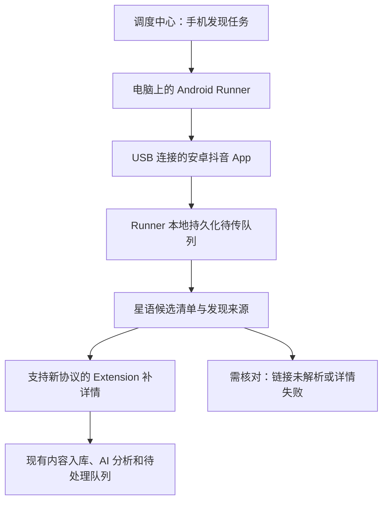

# 抖音安卓手机发现执行器：Hotfix 具体方案

日期：2026-09-22；进展更新：2026-09-23。状态：有限多作品连续交付与真实 USB 中断后的显式恢复已验证；发现率对照、全天稳定性与生产验收未完成。

当前已实现范围见下表，运行命令见 [Runner 实施说明](../../runners/android/README.md)。Mac 与 Smartisan DE106 已完成连接及真机身份校准。40.6.0 已按用户习惯“综合排序＋一天内”运行任务版 Runner；手机发现交给现有 PC Extension 补正文、作者和评论。默认未指定 profile 时仍不可执行，新功能只在隔离试点环境验证，完整自动巡查尚未上线。旧版校准、早期 DNS 与页面故障及后续修复均保留分阶段证据，详见 [9 月 23 日 P0 复测](20260923-android-p0-validation.md) 与 [前一轮记录](20260922-android-de106-p0.md)。

最新补充：40.6.0 两关键词各 3 条真实发现共 5 个不同作品，经既有 PC 采集器修复与正常重试全部入库或复用；随后 6 条新发现零重试完成交付（5 复用、1 新入库）。真实复制链接中 USB 断开约 39 秒，保护暂停、独立停稳和同任务显式恢复通过，恢复后交付 3 条并按原 10 分钟预算结束。隔离库共 8 个不同作品，未重复入库；自动重连与全天稳定性仍未验收。最新阶段、已修问题与限制以 [P0 复测](20260923-android-p0-validation.md) 为准。

| 已实现模块 | 本地验证与边界 |
| --- | --- |
| 独立手机控制面 | 授权注册、幂等创建、按关键词领取与续期、停稳确认、显式恢复；复用原 Agent/task/item/attempt 表，手机不进入旧浏览器入口 |
| 常驻 Runner | setup/start/stop/status/close、固定设备锁、持久化事件与完成回执、后台补传、停稳确认；显式 DE106 40.6.0 试验 profile 已接通，其他组合默认不可执行 |
| 候选与浏览器补详情 | 短链解析、作品去重、共享详情需求、独立 discovered_post_capture 命令、严格同步回执、停止范围隔离；正文 @ 官方作者修复已整合 |
| 调度中心管理入口 | 建任务、候选与正式入库、停止／恢复；新增停稳／设备／时限检查、正确禁用恢复、离线排队及有界结束原因，最新结果见 [上线清单](20260923-android-release-checklist.md) |

本轮本地验收（2026-09-22）：Node 18 全回归 2,559 项通过；Node 24 Runner 80 项通过（含本轮 slides 路由修复）；控制面真实 PostgreSQL 12 个业务场景、候选/详情真实 PostgreSQL 25 个业务场景通过；最终真实 HTTP 鉴权 + SQLite + PostgreSQL 两关键词贯通通过。Admin 构建、新增代码 lint 与既有 lint 基线、Extension 快照一致性及仓库检查通过。管理界面以明确的模拟数据验证创建、停止、最多五条重处理、Esc 关闭及 390px 只读布局。边界检查覆盖 64 个新模块，最大 243 行。上述为本地验证，CI 尚未远端运行。

新功能由 `ANDROID_DISCOVERY_INGEST_TENANTS` 租户白名单控制，默认关闭。服务端新增迁移 086–089；Runner 固定 Node 24，原服务端继续兼容 Node 18。UI 关闭时不轮询，打开时每 15 秒读取并复用进行中的刷新。代码在独立 hotfix 工作树，尚未提交、推送或部署。

本轮真实 HTTP + PostgreSQL + SQLite 联调仅模拟手机页面动作；浏览器补详情另以真实数据库、命令、item/attempt、record-store 和入库回执验证。它们不证明抖音真机选择器、账号行为、手机发现率或实际网页可达率。

初版范围说明：重处理保留原 task 终态与原事件载荷，在原批次上审计并重试未停止、已验证的候选；已停止批次、迟到证据与未验证链接不自动复活。自动短链重试 worker、独立重处理批次、晨巡计划接入仍属于后续目标。

分支：`codex/hotfix-douyin-android-discovery-20260922`

基线：`b0dd8c642bf383ba2af016a5631327a45bfd94e6`。建分支时已只读核对生产 `RELEASE_COMMIT`，与该基线一致；这不是当前生产版本的再次核验。独立工作区为 `/Users/dulaidila/.codex/worktrees/hotfix-douyin-android-discovery/OnStarvoice-2`。

本轮已选用 Mac 主机与 Smartisan DE106 真机，Android 8.1.0／API 27；用户已将抖音 30.6.0 升级至 40.6.0，USB 调试已授权，隔离工具链已安装。本方案采用单台安卓真机、USB 连接常开电脑的首轮设计。本文件定义总体目标；当前实际交付范围以上表及各模块 README 为准，真机 P0 验收尚未完成。

## 1. 要解决的问题和第一版成果

网页端关键词巡查未能稳定发现用户在手机端能找到的部分帖子，后续由用户逐条搜索、复制链接和核对。另有部分帖子虽然已经采集，却因作者误识别被隐藏；两个问题需要分别记录和验收。

第一版完成：手机自动搜索公开作品，取得与当前作品对应的分享链接，将发现结果可靠交给星语；星语记录每条候选的去向，再由支持新协议的浏览器 Extension 补详情。用户能看见“发现了什么、哪些已入库、哪些需要处理”。

验收分为两件事：执行器是否正确、可靠地完成操作；手机入口是否实际提高发现率。前者通过不能替代后者通过。

| 第一版包含 | 后续阶段再评估 |
| --- | --- |
| 一台真机、一个已登录账号、一条手机执行槽 | 多手机调度、云手机、iOS、手机脱离电脑独立运行 |
| 人工启动两关键词的小批试验 | 接入既有 05:30 晨巡、自动扩展到 13 个关键词 |
| 综合结果入口，逐轮验证实际排序与时间筛选 | 未在真机验证的图文专栏、多种 App 布局 |
| 搜索列表线索、分享链接、来源与异常证据 | 手机端完整评论、媒体下载和粉丝指标采集 |
| 候选去重、补详情、停止、断线恢复 | 自动处理登录或验证码、自动切账号 |

正文 @ 官方不等于官方发布。浏览器补详情上线前，必须先发布并验收独立分支 `codex/hotfix-douyin-author-mention` 的作者识别修复，或在实施分支中明确整合相同修复。本分支已整合作者识别修复的最小补丁，不包含该分支中无关的关键词账号功能。

## 2. 现状：可复用与必须新增的边界

本轮只读审查了基线代码，接口和文件位置见附录 A。

| 现有能力 | 本方案的使用方式 |
| --- | --- |
| 授权绑定、Agent token、节点心跳 | 复用认证与节点基础设施，补充明确的手机节点类型 |
| `capture_tasks`、item、attempt、命令和回执 | 沿用任务生命周期与执行归属校验，新增两种 workflow |
| 节点占用锁、停止请求、操作审计 | 手机按一机一槽参与；停止必须有执行端证据 |
| 已有内容按租户、平台、作品 ID 去重 | 补详情入库时继续复用，不把候选数量当新增入库数量 |
| 既有 Extension 详情与评论采集 | 增加候选补详情协议后复用，不重新实现整套采集 |

有三个已经确认的接口限制：

1. `utils/cloud-targeted-post.js` 只接受既有五类 workflow，目标必须已有 `recordId`。新发现链接不能直接投入这一协议，也不应先伪造一条正式内容来满足参数。
2. `/api/sync` 仍需要既有授权，Agent token 只是附加的任务归属证据。手机候选应进入专用发现接口，不能假定它能直接调用旧同步接口。
3. 当前部分调度判断依赖平台与浏览器通用能力。新增手机节点后，手工创建、计划分配、弹性领取、接力和命令交付都需要校验任务与设备种类，不能仅在界面上区分。

## 3. 部署结构与设备准备

主机运行 Node.js 编写的 Runner、Appium 和 UiAutomator2 驱动；手机保持官方抖音 App 已登录。客户端工具链独立锁版本，不要求生产服务端随之升级 Node。Appium 支持 Windows、macOS 和 Linux 主机及安卓真机；具体版本组合由 P0 冻结并形成设备验收清单。[S1]

首轮准备清单：

- 优先选一台已有闲置安卓手机，能正常安装和使用抖音、能通过 USB 调试连接。选型前不采购设备；具体支持版本按锁定驱动的要求检查。
- 一台可保持运行的电脑、可传输数据的 USB 线、持续供电与正常网络。手机执行时占用前台，主机休眠、手机锁屏等状态需明确显示为不可执行。
- 操作员完成手机解锁、USB 调试连接确认和抖音登录。执行器检查状态，不接管密码或验证码输入。[S2]
- 将真实设备序列号绑定到独立的 Runner 设备身份，明确选择该设备，不能使用“第一台连接的手机”作为默认目标。
- Appium 与 ADB 控制服务仅监听本机；Runner 向现有服务器主动发起 HTTPS 请求。登录态保留在手机，节点凭证保存在主机的受限凭证存储中。
- 登记主机 OS、手机型号、安卓版本、抖音版本、驱动版本、显示设置；首轮只承诺这一组合通过验收。

首轮不要求手机刷机、获取 root 或修改抖音安装包。手机独立 APK 不是第一版交付物；Appium 所需的设备辅助组件随工具链配置，并在准备步骤中明确列出。

## 4. 手机一次任务怎么执行

### 4.1 首轮默认参数

以下是方案默认值，不是已经修改的线上配置。

| 参数 | 默认值与含义 |
| --- | --- |
| 关键词 | `别克壁纸`、`君越壁纸`，两词分别记录结果 |
| 内容入口 | 综合结果入口；可见的视频与图文都可成为候选 |
| 排序／时间 | 默认“综合排序、一天内”；按用户 9 月 23 日的实际习惯设置。“最新发布”保留为显式选择 |
| 数量上限 | 每词最多取得 20 个去重后的有效作品链接；重复作品单独计数 |
| 工作量上限 | 每词最多检查 40 张结果卡片、20 次滑动或 10 分钟，任一先到即结束该词；全批最多 25 分钟 |
| 并发 | 每手机 1；首轮浏览器补详情并发 1，并沿用既有资源限制 |
| 自动恢复 | 单次普通加载失败最多一次有界重试；登录、验证码、身份不匹配不自动重试 |
| 停止原因 | 分别显示“结果到底”“达到条数”“达到时间／滑动上限”“平台阻断”“用户停止” |

### 4.1.1 当前手机全部筛选选项

以下选项在 Smartisan DE106 的抖音 40.6.0 真机筛选面板逐项读取，非由旧版截图推测。用户确认于 9 月 23 日上午主动升级了 App；早先 30.6.0 的 20 条校准证据保留原版本。

| 筛选组 | 当前 App 可选项 | 首轮默认 |
| --- | --- | --- |
| 排序依据 | 综合排序、最新发布、最多点赞、最多评论、最多收藏 | 综合排序 |
| 发布时间 | 不限、一天内、一周内、半年内 | 一天内 |
| 视频时长 | 不限、1分钟以下、1-5分钟、5分钟以上 | 不限 |
| 搜索范围 | 不限、关注的人、最近看过、还未看过 | 不限 |
| 内容形式 | 不限、视频、图文 | 不限 |
| 位置距离 | 不限、同城 | 不限 |

“综合”结果入口与“综合排序”是两个不同状态，分别核对。“一天内”使用 App 的实际筛选选项，不改写成“今日零点起”，也不以“最新发布”替代时间筛选。每个关键词开始时设置条件，返回搜索结果时再次读回全部六组；未知控件、多个选中值或状态不一致均暂停。

当前正式任务协议开放“综合排序／最新发布＋一天内”；其余选项已整理并可识别，不等于所有组合都完成采集验收。P0 默认值在管理页、后端和手机适配层保持一致。新版筛选面板使用语义分组及当次读取的控件边界定位，没有把某个固定屏幕坐标写死。

“连续滑动没有新卡片”仅表示本轮停止，不证明平台没有更多结果；达到预算也不能显示为“全部搜完”。筛选未能从页面确认时，结束为需处理，不能悄悄按未筛选结果执行。

### 4.2 执行步骤

1. **领取与预检。** 验证任务、设备、执行代次；检查手机在线、屏幕可操作、抖音前台与登录状态。检查停止指令后才开始 UI 动作。
2. **搜索与筛选。** 输入本轮关键词，等待结果；从可见页面核对关键词、排序、时间范围。保存本轮实际生效条件和证据时间。
3. **识别候选卡片。** 读取卡片标题、作者显示线索、发布时间原文和位置。页面控件优先；OCR 只作线索或诊断，不能用识别出的名字生成作者账号 ID。
4. **打开并核对作品。** 记录卡片到详情的对应关系；读取发布者区域和作品正文，防止把推荐内容、评论者、@ 提及当作目标。
5. **取得当前链接。** 通过分享菜单的“复制链接”读取作品地址；把这次复制与当前详情证据绑定。若拿到个人主页、搜索页、旧剪贴板或无法确定归属的链接，保留异常，不继续入库。
6. **本地落盘后回传。** 先持久化事件，再按小批上传。服务端回执到达后标记已确认；网络中断不丢弃已经落盘的发现。
7. **返回结果页。** 核对仍是当前关键词和筛选，再继续下一张。丢失搜索上下文时按新尝试重新建立上下文，并按作品 ID 去重，不能盲目沿用滚动位置。
8. **收尾。** 回传发现阶段的统计和停止原因，停止后续设备动作。发现完成与后续详情完成分别呈现。

### 4.3 复制链接是 P0 的关键技术验证

驱动提供剪贴板读写命令，但 Android 对后台应用读取剪贴板存在限制；不能仅凭工具文档认为本机抖音一定可用。[S1][S3]

P0 应验证“打开详情 → 点复制链接 → 取得新值 → 确认当前作品 → 返回列表”全过程。专用试验机上允许使用一次性剪贴板标记，确认复制产生了本次的新内容；不读取或上传与任务无关的剪贴板历史。如果需要切到辅助组件读取，必须验证返回抖音后上下文仍正确。路径不稳定就停止扩大开发范围，记录为该设备组合未通过。

若分享菜单没有复制链接、剪贴板始终不可读或链接归属不能核对，保存 `link_unverified` 事件及页面证据。第一版不使用标题猜测作品 ID，也不以人工逐条复制作为自动化验收通过的替代。

## 5. 接入任务系统的具体设计

本节接口已按首版实现更新；持久节点类型保存在 capabilities.agentKind，未新增 agent_kind 列。

### 5.1 节点与能力

新增服务端认可的 `agentKind=android_mobile`；既有节点默认为 `browser_extension`。手机节点按独立 `clientUuid` 注册，不能与连接电脑上的 Chrome／Edge 节点共用身份。环境展示增加手机型号、安卓版本、抖音版本、USB 状态和设备忙闲。

| 节点 | 第一版允许的任务能力 |
| --- | --- |
| 手机 | `mobileSearchDiscoveryV1=true`、`supportedPlatforms=["douyin"]`、单执行槽、停止回执能力 |
| 已升级浏览器 | `discoveredPostCaptureV1=true`，沿用实际支持的平台与详情能力 |
| 未升级浏览器 | 继续现有任务；不能收到新候选补详情协议 |

手机不声明网页关键词采集、评论巡查或其他尚未实现的能力。服务端在所有创建、选择、领取、接力、交付入口同时校验 `agentKind + workflow + capabilities + tenant + platform`，旧浏览器缺失新增能力时明确不匹配。

### 5.2 两个 workflow

- `douyin_mobile_discovery`：手机搜索发现，输入为关键词、筛选、预算和截止时间，输出为发现事件与候选关联。
- `discovered_post_capture`：浏览器补详情，目标为 `candidateId + externalId + canonicalUrl`。此路径允许尚无 `recordId`；旧五类定向任务仍保持原有 `recordId` 校验。

沿用已有任务总状态：`pending → claimed → running → completed / completed_with_warnings / needs_action / failed / canceled`，断连可进入 `interrupted`。具体动作写入 `stage`，例如 `preflight / searching / collecting_links / delivering`，避免另建与现有看板不兼容的总状态体系。

手机发现 task 作为本轮根标识 `discoveryRunId`，一个关键词对应一个手机 item；浏览器详情 item 与它是不同的执行单元，使用各自的 attempt 和 assignmentRevision。每个候选建立独立的浏览器详情 task 与 item；其他轮发现相同候选时，通过第 6 节的需求关联表引用已有有效 item，不重复排队。

`uploadBatchId` 只表示一次网络上传的小批，不能用它分组业务任务或确定停止范围。批次回执查询中的 batchId 使用 uploadBatchId；设备与界面上的“本轮”使用 discoveryRunId。

发现任务完成后，批次的端到端汇总仍需显示待补详情数量；不能因为手机停下了就把后续任务一起标为成功。手机阶段结束只更新根 task，批次详情结果由关联表汇总，不把根 task 从 completed 反复改回 running。

### 5.3 接口与鉴权

| 接口 | 方案 |
| --- | --- |
| `POST /api/capture-cloud/android/register` | 独立注册入口，复用租户、授权码、绑定及 token 签发机制；只有试点租户允许注册手机节点 |
| `POST /api/capture-cloud/android/agent/poll` | 独立手机领取与状态检查；旧浏览器心跳入口拒绝手机节点 |
| `POST /api/capture-cloud/android/agent/renew` | 手机执行许可续期，验证当前 task／item／attempt／assignmentRevision 与停止状态；在线心跳本身不构成继续操作许可 |
| `POST /api/capture-cloud/agent/discoveries` | 新增，接收一批发现事件；强制 Agent 身份及完整执行归属，返回逐条接收结果 |
| `GET /api/capture-cloud/agent/discovery-receipts?batchId=…` | 新增，仅允许本节点核对自身批次回执，处理 HTTP 结果未知 |
| `GET /api/capture-cloud/tasks/:id/discoveries` | 新增，供本租户授权用户查看候选、来源、去向和未完成原因 |
| `POST /api/capture-cloud/tasks/:id/discoveries/reprocess` | 新增，本租户有写权限的用户选定 1–5 个已验证事件或候选，幂等记录 requestId 并重新解析/排队；原任务终态保持不变，已停止/迟到证据不复活 |
| `/api/capture-cloud/android/runs/:id/stop`、`/android/agent/complete`、`/android/agent/close` | 手机控制与回执独立；浏览器详情继续使用旧 commands 完成协议并增加实际入库结果投影 |
| `/api/sync` | 手机不直接写只有链接的内容；浏览器补详情后沿用既有鉴权、入库与同步回执链路 |

发现请求必须包含 `discoveryRunId、taskId、itemId、attemptId、requestHash、assignmentRevision、agentId、uploadBatchId、eventId`；手机发现时 discoveryRunId 等于 taskId。租户与真实节点身份从凭证推导，不信任请求自报的租户。缺少完整归属时拒绝，不能降级为无归属上传。

响应应逐条区分 `accepted、duplicate、rejected`，并返回 `eventId、candidateId、receiptId、reason`。accepted 只表示事件与回执已持久化，允许 candidateId=null，不表示已经补详情或入库。已成功接收的事件重传，在验证同租户、同节点及有效载荷后优先返回原回执，不因原尝试后来过期而改为拒绝；首次收到的过期事件才使用 late_audit 规则。身份冲突拒绝后保留本地队列供核对。相同 eventId 的有效载荷哈希必须一致，不一致返回 409，不覆盖原证据。

## 6. 候选数据、去重和正式入库

### 6.1 候选与来源业务表

086 建立三张候选/事件/需求业务表；087 为控制面补充索引；088 增加重处理幂等请求表与详情索引。

| 表 | 主要字段与约束 |
| --- | --- |
| `capture_discovery_candidates` | `id、tenant_id、platform、external_id、canonical_url、status、first_seen_at、last_seen_at、record_id、detail_task_item_id、last_error`；external_id 非空时 `(tenant_id, platform, external_id)` 唯一 |
| `capture_discovery_events` | `id、candidate_id、tenant_id、agent_id、task_id、item_id、attempt_id、assignment_revision、request_hash、event_key、payload_hash、upload_batch_id、keyword、requested_filters、observed_filters、raw_share_url、title_hint、author_hint、publish_time_raw、discovered_at、received_at、evidence_ref、receipt_status、resolution_status、resolution_attempts、next_retry_at、resolution_error、verified_external_id、delivery_mode、review_result、reviewed_by、reviewed_at`；`(tenant_id, agent_id, event_key)` 唯一 |
| `capture_discovery_run_candidates` | `tenant_id、run_id、candidate_id、detail_task_item_id、first_event_id、demand_status、is_detail_owner、record_id`；`(tenant_id, run_id, candidate_id)` 唯一；记录每轮补详情需求、取消状态和结果归属 |

`event_key` 在本地首次落盘时生成，网络重试保持不变；事件里的原始 attempt 身份不可在重传时替换为新尝试。作品身份尚未解析时，事件可暂时没有 candidate_id，展示为“链接待解析”。多关键词和多次发现保留各自事件，不用覆盖候选行来代替来源历史。

候选状态拟定为 `queued、capturing、stored、already_exists、needs_review、failed`；未解析链接属于发现事件的状态。关联表的 demand_status 为 `active、fulfilled、canceled、needs_action`，同一轮的重复发现不重建需求。任务是否结束、候选是否入库、网络交付是否确认是三个独立维度。

首版关联表 run_id 指手机 discoveryRunId，原发现来源通过 first_event_id 可追溯；重处理请求单独存储幂等键及审计结果，不新建手机根 task。事件解析状态为 `pending、resolved、needs_review、unresolvable`，分别记录错误与下一重试时间；人工可选择“重新解析并补详情”或“确认无法处理”，后者只更新带操作员和时间的核对记录，不删除证据。

`is_detail_owner` 标识最初创建有效详情工作的那一轮，唯一归属以实际成功同步回执为准。其他轮可显示“共享补详情已入库”，但不能重复计为本轮新增。取消某轮需求不会删除候选及历史来源，也不会把其他轮的需求一起取消。

人工重处理不会替换历史 attempt 或原事件载荷：首版保存 requestId、选择范围与处理结果，重新校验链接身份，再激活未停止批次的详情需求；新的浏览器任务拥有新 attempt。它不再执行手机搜索，也不复活已停止的原任务；已有记录保留可见性，迟到或未验证证据继续核对。独立重处理批次属于后续能力。

### 6.2 短链解析与身份验证

接收抖音分享文本时只提取明确的抖音 URL。解析使用专用解析器，限制允许的主机、重定向次数和超时，防止任务链接引导服务器访问内部地址；不得从无关推荐页或搜索页猜作品 ID。

解析成功后产出 `externalId + canonicalUrl`；有明确图文／视频路由时保留对应路径，没有证据时不强行按视频处理。链接与页面作品身份冲突进入需核对。不同短链可归并到同一个作品；标题相同的不同作品不得合并。

### 6.3 同一候选只生成一份当前有效补详情工作

短链网络解析在数据库事务外完成并受时间预算限制；失败可先持久化待解析事件。对已解析事件，服务端事务执行“幂等接收事件 → 归并候选与本轮需求 → 检查既有正式记录与有效补详情任务 → 必要时创建补详情工作 → 写接收回执”。候选行锁或等效唯一约束保护并发，不能先返回成功再依赖内存队列创建任务。首版解析失败后留在待核对清单，由用户选定重新处理；自动三次重试 worker 尚未实现。重新处理必须检查停止范围和原链接的验证证据：整批停止或停止范围不明确时拒绝；仅停止手机发现时允许明确重试已保留候选，不恢复手机搜索。

- 正式记录已存在：关联实际 `recordId`，标为“已存在”，显示当前业务可见性及排除原因。已有记录被误隐藏时进入核对，不能仅用“已存在”掩盖问题，也不能因再次发现自动解除官方或无关分类。
- 已有待执行／运行中的补详情任务：关联现有任务，保留新增发现来源。
- 没有正式记录且没有有效工作：创建一个候选补详情 item，仅派给声明新能力的浏览器。
- 补详情失败或页面不可达：候选继续可见，显示失败原因和后续操作；不假装已经入库。
- 详情作品身份确认、实际同步回执成功：绑定真实 recordId；继续沿用正式内容的 AI、业务可见性和待处理规则。

手机侧的作者名、OCR 文本和正文 @ 内容只作原始线索，不直接生成强作者身份，也不据此排除官方内容。第一版候选阶段不执行 DeepSeek 的不可见硬丢弃；相关性处理在详情证据充分后沿用正式链路，并保留结果可核对性。

候选不参加客户日报新增量。日报仍只统计首次成功入库的正式记录；重传、重复发现和补详情重试不能增加新增量。网页补详情不可达的手机候选留在“发现候选”页面，第一版不自动把不完整线索转为正式日报内容。

## 7. 可靠性、停止和资源控制

### 7.1 本地持久化与上传

Runner 使用独立 SQLite 本地队列保存事件、检查点与回执，不读取抖音私有数据库。UI 发现后先落盘，上传失败只重传同一事件，不重新操作手机来“补上传”。主机程序重启后先核对云端任务、尝试与回执，再决定下一步。

初始上报按最多 5 条或最多等待 5 秒形成小批；轻量存活心跳拟为 30 秒一次，完整心跳 60 秒或有状态变化时上报。状态变化可合并，不能每次滑动都触发全量任务看板查询。间隔需遵守现有 token 与调度协议，并在实施测试中确认。

服务端明确 503／限流时遵守 `Retry-After`；未知 HTTP 结果先核对回执，再重传同一 uploadBatchId。候选任务创建与接收回执同事务保证，不依赖重试次数实现去重。

试点每批最多 40 个已验证作品；未上传队列超过 100 条或待补详情超过 50 条时暂停继续发现并显示积压，不能无界增加数据库和浏览器负担。恢复后在原任务预算内继续，不自动扩大全批上限。

### 7.2 设备锁与执行代次

一台手机只有一个 Runner 控制锁和一个云端执行槽。设备序列号绑定、Agent 身份与任务代次同时验证，禁止另一进程或另一个任务并发操作。USB 断开立即停止发出动作；短暂网络失败只允许在最后一次有效执行许可内操作，到期后停止新动作。

执行许可是本方案新增契约，不是现有在线心跳的等价物。手机每 30 秒向 mobile-lease 续期，服务端验证当前归属与停止状态后返回 `leaseId、serverTime、leaseUntil、assignmentRevision`，初始有效期 90 秒。Runner 用请求开始时的本地单调时钟加返回有效时长建立保守期限；已经超过该期限或属于旧代次的响应作废，续期请求不并发。在每次 UI 动作前检查停止标记、许可和任务剩余预算。停止或许可被撤销即拒绝续期。正常联网下，远程停止最迟在下一次成功续期校验时被 Runner 得知；网络完全中断时，延迟上限受剩余许可与当前操作超时限制，不能宣称也满足本地 5 秒目标。

重连时旧任务不得自行继续。服务端明确当前 assignmentRevision、attempt 和剩余预算后，才允许新的恢复尝试。剩余条数、滑动和时间预算按整个根 task 累计，重启不能归零。旧尝试的未传事件仍使用发现接口，但标记 `deliveryMode=late_audit`；服务端验证它属于真实历史尝试及该节点，只保留迟到证据和核对结果，不自动新建浏览器补详情任务，也不修改任务终态。不能修改原归属来绕过过期校验；未实际分配过的伪造历史身份仍拒绝。

若旧执行端是否已经停止无法确认，设备保持不可分配。只有本地停止证据或操作员完成接管核对后才释放控制资格；服务端不能凭超时把手机认作安全空闲。

### 7.3 停止、暂停与人工接管

界面提供两个明确动作：

- **停止手机发现**：停止翻页、开帖和复制新链接；已发现候选保留，已创建的浏览器补详情可继续。
- **停止整批采集**：停止手机发现，在事务内取消本轮详情需求；仅当某个详情 item 没有其他有效需求时，才取消未领取工作或向运行端下发停止。若其他轮仍需要该作品，界面明确显示“本轮已停止，其他批次继续补详情”；已入库数据保留。派发和新增需求事务也必须检查根 task 的停止标记，封闭停止与新上传之间的竞态。

本地 Runner 提供独立“立即停止／人工接管”控制，云端不可用时也有效。第一版以显式接管为准，不宣称能可靠识别操作员的每一次触摸。

停止性能目标：收到本地停止信号后 5 秒内不再发起新的 UI 动作，15 秒内结束当前有界操作并回报设备静止状态；这是待真机验收的目标。命令超时或无法确认时显示“停止待确认／需接管”，不得先显示取消成功。通过逐命令超时与独立控制通道保证停止不被长时间采集调用饿死。

验证码、登录失效、手机锁屏、异常弹窗进入 `needs_action`；保存检查点，停止新动作，操作员处理后显式恢复。恢复仍需重新核对页面与剩余预算。重放旧 create、旧完成回执或旧发现事件都不能复活已停止任务。

## 8. 用户在调度中心看到什么

沿用现有调度中心，新增受试点开关控制的“手机发现”任务入口和 Android 节点展示。首版由用户人工发起，现有晨巡计划保持原定义。

节点显示：设备名称、手机已连接／未连接、抖音可执行／需登录／需接管、当前关键词和最近业务进展。节点心跳在线不能替代手机可执行状态。

任务显示两段进度：“手机发现”与“详情入库”。候选表至少包含标题线索、作者线索、发现关键词、原帖链接、发现时间、详情任务、入库记录和未完成原因；用户可以从候选直接打开原帖与相关任务。

| 指标 | 明确定义 |
| --- | --- |
| 检查卡片数 | 页面检查动作计数，可含重复，不作为独立作品数 |
| 有效作品数 | 本批成功解析并验证身份的不同 externalId 数量 |
| 链接待核对数 | 尚无可靠作品 ID 的事件数，不与有效作品数相加宣称去重总量 |
| 待补详情／详情失败 | 候选当前对应工作状态 |
| 本批新增入库 | 由本批首次成功创建的正式记录数，不含既有记录 |
| 已存在 | 发现时已有正式记录的作品数，同时展示其业务可见性 |

任务卡示例：“已确认 18 个作品：新增入库 7、已存在 6、待补详情 3、详情失败 2；另有 1 条链接待核对”。这些是界面示例数字，不是实测结果。

截图仅用于必要的搜索条件、身份不一致和失败诊断，优先裁剪作品区域；设备通知、登录和验证码页面不作为普通内容上传。试点证据默认留存 7 天，访问跟随租户权限；正式留存规则在上线前与现有证据策略对齐。

## 9. 分阶段实施与退出条件

| 阶段 | 具体交付 | 通过条件 |
| --- | --- | --- |
| P0：真机技术验证 | 设备清单、固定工具链版本、搜索／筛选／复制／返回的录证脚本和报告 | 同一设备完成至少 20 个公开作品的身份核对，覆盖视频和图文；链接与作品零错配；明确剪贴板读取方式及停止行为 |
| P1：手机发现 Runner | 本地控制、关键词预算、可靠队列、断线及重启恢复、显式人工接管 | 单机完整跑完两关键词；断线不丢已落盘事件；超预算不继续搜索；停止与重连测试通过 |
| P2：星语与 Extension 接入 | 新节点类型、发现接口、候选清单、新补详情 workflow、详情入库回执和操作界面 | 端到端从手机链接到正式记录；旧节点不领新任务；候选和日报计数分离；幂等与停止测试通过 |
| P3：限定试点 | 一个租户、一台手机、两个关键词，至少连续两天、三个完整对照轮次 | 确认手机产生网页未发现的有效增量；报告人工介入次数、每新增作品耗时、阻断及入库情况，再决定是否纳入晨巡 |

P0 任一关键能力不成立，则形成具体阻断结论，调整设备或方案再验证，不把未验证的手机交给早上计划。第一版整个试点保持显式开启，不自动替换既有浏览器巡查。

真机适配及试点工时在完成 P0 后给出；当前仅完成一次短时 UI 闭环，第四次会话的约 2 分钟复测未跨过此前 17 分 19 秒的系统终止窗口，完整身份与长期稳定性仍未通过验收，不能据此推算生产交付日期。

本轮 Appium 临时服务已停止，ADB 保留。下一步按已保存的校准配置开展长期稳定性复测，补齐分享链接的 externalId／浏览器详情身份及安全解析联调，再完成 P0 的 20 条作品、持续筛选、停止和断线验证；通过前不开放 Runner 自动搜索，也不接入正式巡查。阶段证据见 [DE106 P0 阶段记录](20260922-android-de106-p0.md)。

## 10. 验收用例与发现率评估

### 10.1 必须通过的正确性用例

| 用例 | 预期 |
| --- | --- |
| 卡片与打开的作品不一致 | 拒绝把链接绑定到卡片，进入核对 |
| 正文 @ 官方、评论者同名 | 不能生成官方发布者身份；补详情使用已修复的作者核对 |
| 剪贴板保留上一条链接 | 本次复制验证失败，不上传为新作品 |
| 两个关键词、两种短链命中同一作品 | 一份候选，一份当前有效详情工作，多条发现来源 |
| 两轮共享详情工作，其中一轮停止 | 仅撤销本轮需求，另一轮继续；作品新增入库只归属一次 |
| 同标题的不同作品 | 按不同作品 ID 保留 |
| 服务端已接收、客户端没收到响应 | 重试得到原回执，不重复排队、不重复计入库 |
| USB 断线／主机重启／租约过期 | 停止动作；核对代次后恢复；旧回执不能覆盖新尝试 |
| 手机任务停止后重放命令或上传 | 不复活任务、不新建补详情工作；迟到证据可追溯 |
| 停止整批时浏览器正在补详情 | 两端分别确认停止，未完成时显示待确认 |
| 手机节点与旧浏览器参加调度 | 任务种类硬隔离，不能互相冒领 |
| 网页补详情不可达 | 手机候选仍可见，有明确失败原因，业务入库数不虚增 |
| 已入库但被官方／无关分类隐藏 | 显示真实排除状态和核对入口，不显示为未找到或自动解除分类 |
| 筛选不生效／没有新卡片／达到预算 | 分别说明原因，不能把不确定状态算空结果或全量完成 |
| 503 与队列积压 | 退避、持久化与背压生效，不产生请求风暴 |

### 10.2 业务效果测量

同轮记录网页和手机实际搜索条件、起止时间、账号、版本和结果 ID；账号或条件不一致时明确标注，不能把结果差异直接归因于端类型。交替执行顺序，减小时间变化带来的偏差。

每轮输出可复算明细：`roundId、source(web/mobile/manual)、keyword、accountRef、filters、startedAt、endedAt、timeBudget、cardBudget、externalId、sampleEligible、relevanceConfirmed、recordId、manualMinutes、blockReason`。人工基线由操作员在同样两关键词和相同时长上限下独立补搜，记录有效链接与主动操作分钟数；按轮次交替顺序，并标注预先知道样本造成的偏差。各端实际预算均随结果公开。

已知样本先纳入今天用户确认的作品，再扩充到至少 20 条人工核对的公开作品。只将发布于该轮搜索开始之前、处于目标时间窗口内的作品纳入该轮命中率分母；巡查结束后才发布的帖子不算漏采。

- 已知样本命中率 = 本轮发现的合格已知样本数 ÷ 本轮合格已知样本数。该指标不代表全平台召回率。
- 手机增量 = 同轮手机有效作品 ID 集合减去网页有效作品 ID 集合，再人工确认相关性后的数量。
- 交付完成率 = 本轮新候选中成功形成正式记录的数量 ÷ 本轮需要补详情的新候选数量；待处理与失败单独列出。
- 操作成本 = 每新增有效作品耗时、每轮人工接管次数与分钟数、每轮设备占用时长。

每轮分别报告网页、手机、二者并集的已知样本命中率；列出手机独有的相关作品 ID 和其最终入库结果，不能只给比例。已知样本清单在每轮开始前固定，过期或已删除样本注明理由后排除，不能看到结果后增删分母。

初始推广门槛：三个完整对照轮次中至少两轮有经核对的手机有效增量、合计至少 3 个不同增量作品；至少 90% 的新候选完成详情交付（分母不足 10 条时要求全部完成，并继续补充样本）；每轮人工主动介入不超过 5 分钟，三轮合计主动工时比人工补搜基线至少减少一半。身份错配、重复正式入库和停止后错误续跑必须为零。以上是拟定试点门槛，可在 P0 后、正式对照开始前调整并记录，不能事后降低门槛来宣称成功。

满足门槛也只进入扩大试点评审，不直接替换全部晨巡。如果没有有效增量或接管成本未改善，保留结论，暂不扩大设备规模。

## 11. 代码落点与实施拆分

下列为实施建议，不表示本轮已经新增这些运行文件。

| 位置 | 拟承担职责 |
| --- | --- |
| `runners/android/`（新增独立包） | 配置、设备绑定、Appium 适配、搜索状态机、SQLite 队列、上传、控制与健康检查 |
| `server/routes/verify.js`、`server/services/capture-cloud.js` | 手机节点注册、环境类型、凭证和能力约束 |
| `server/routes/capture-cloud.js`、`server/services/capture-orchestration-scheduler.js` | 新任务校验、领取隔离、心跳、停止与执行归属 |
| `server/routes/capture-discoveries.js`、`server/services/capture-discoveries.js`（新增） | 发现接收、短链身份解析、去重、回执、候选查询和补详情排队 |
| `server/db/migrations/` | 新候选与事件表、租户索引、幂等约束和关联字段；迁移编号实施时确定 |
| `utils/cloud-discovered-post.js`（新增协议模块）及现有执行入口 | 新候选补详情契约；调用既有详情采集能力并沿用入库回执 |
| `web/admin/src/pages/dispatch/cloud-tasks/` | 手机入口、节点状态、候选表和两段进度；开发前逐项核对实际组件职责 |
| `tests/` 和独立 Runner 测试 | 协议、租户隔离、幂等、任务恢复、停止、版本兼容与真机验收 |

建议分为三个可单独评审的实现提交：Runner 与 P0/P1 验证；服务端候选与任务契约；Extension 与调度中心接入。服务端继续兼容旧 Extension；新功能由租户开关和节点能力共同控制。

## 12. 发布、回滚与本轮交付状态

实施后的上线顺序：数据库新增结构与服务端兼容能力 → 支持新补详情协议的 Extension → 单台 Runner → 试点租户开关。开关启用前确认作者识别 hotfix 已在实际执行浏览器加载，确认手机操作与停止验收完成。

关闭试点时停止两类新任务、等待运行端确认并保留候选及审计。回滚应用保留新增表和已入库业务数据，不用删表或清空候选作为回滚手段。旧浏览器计划继续执行原协议。

本方案首次交付时仅创建独立 hotfix 工作区和方案。随后用户已授权在手机到位前开始开发；当前实施状态见文首链接，正式巡查计划和生产发布保持独立验收。

## 附录 A：已核对的代码依据

相对路径均以本方案所在仓库根目录为准，行号对应基线 `b0dd8c6`。

- `server/routes/verify.js:191`：签发 captureAgent；`server/services/capture-cloud.js:1084`：租户、授权与节点绑定。
- `server/services/capture-cloud.js:253`：当前环境按浏览器与桌面 OS 识别；`:995`、`:1005`、`:1049`：执行占用与锁。
- `server/routes/capture-cloud.js:8666`、`:8720`：轻量存活与完整心跳；`:8979`、`:9004`、`:9096`：停止优先、命令与完成回执；`:9270`：回执身份校验。
- `server/routes/capture-cloud.js:7130`：弹性领取能力判断；`server/services/capture-orchestration-scheduler.js:129`：计划节点能力判断。
- `server/routes/capture-cloud.js:16266`、`:16363`：停止入口与未下发命令取消；`:6711`：旧执行状态防覆盖。
- `utils/cloud-targeted-post.js:15`、`:434`：workflow 白名单与已有 recordId 要求；`:200`：目标 URL 身份校验。
- `server/routes/sync.js:357`、`:428` 与 `server/middleware/auth.js:253`：内容同步的授权与附加 Agent 身份。
- `server/services/record-store.js:788`、`:939`、`:1194`：尝试归属、观察记录幂等和正式内容去重。

## 附录 B：外部工具依据

以下资料于 2026-09-22 核对，用于工具能力判断，不构成“当前抖音真机流程已验证”的证据。

- [S1：Appium UiAutomator2 官方仓库与驱动说明](https://github.com/appium/appium-uiautomator2-driver)：安卓真机、主机支持、依赖要求及 `mobile: getClipboard`／`setClipboard`。
- [S2：Android Debug Bridge 官方说明](https://developer.android.com/tools/adb)：USB 调试连接与设备端授权确认。
- [S3：Android 10 隐私变更——剪贴板访问限制](https://developer.android.com/about/versions/10/privacy/changes#clipboard-data)：后台读取限制，需要在所选设备上验证实际链路。
