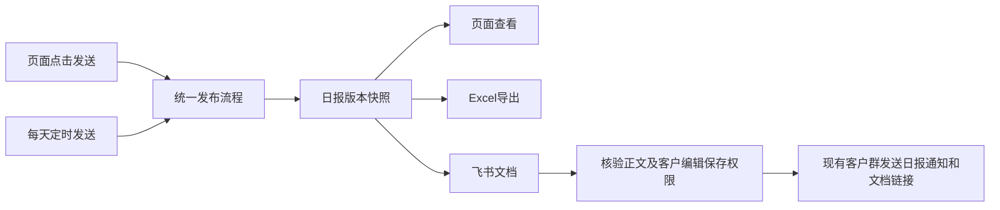

# 客户舆情日报方案

版本：v4 · 2026-09-08 · 客户可编辑交付，复用现有客户群和我方飞书接入，支持Excel及手动/定时发送
范围：需求理解与实施设计，未修改业务代码、未查询生产、未生成或发送真实日报。
依据：客户提供的表格及本任务补充确认、关联任务「整合无人巡检与负面巡查」及其最新近7天确认方案、当前工作区代码（8477715）。当前工作区事实不代表生产部署状态。

## 1. 已确认的需求

在现有报告中心增加一份独立的「客户日报」，包含三部分：监控汇总表、近7天高互动负面帖子、当天新增冷处理负面链接。

客户已明确：

1. 默认出前一天日报。9月8日打开时默认选择9月7日。
2. 9月8日上午新采集并处理完的数据归9月8日，可以查看、生成9月8日的实时日报，不归到9月7日。
3. 监控数量只统计系统首次采到、成功入库的新帖子。旧帖再次采集和负面巡查都不增加监控数量；同帖重复命中关键词或节点也只计一次。
4. SDB范畴只从监控数量中扣除状态为「已复核-非监控内容」的数据，字段值为 `reviewed_non_monitor`。
5. 系统掌握负面与冷处理；「处理中」「已处理」由客户飞书表维护，因此保留这两列并留空。空白不代表0，不从已回复、飞书表号、归档等字段推算。
6. 第二部分列出近7天内热度≥200的负面帖子，热度就是互动，必须带原帖链接。
7. 第三部分列出报表日新标记为冷处理的负面帖子，同样带链接。
8. 日报在页面可查看，能够导出Excel；Excel属于首期范围。
9. 支持生成飞书文档，通过机器人每天发到指定群聊；也可在页面主动触发发送。
10. 我方与客户属于不同飞书组织。用户已完成我方「文档写入助手」接入，愿意补充必要配置；优先复用这份现有接入，不能把客户默认当成同一组织。
11. 用户目前已在客户的群中，优先使用现有群；无需为了此功能先把客户拉入我方新群。
12. 客户是业务数据owner，必须能取得日报并编辑、保存，不能只交付只读链接。系统初次生成的处理中/已处理为空，客户后续可以补填。

以下的MTD算法、定稿流程、冷处理事件细则和涨跌缺测展示是本稿建议，尚不是额外获得的客户确认。

## 2. 日期与生成方式

统一使用北京时间（Asia/Shanghai），区间采用左闭右开。

| 概念 | 规则 | 示例 |
| --- | --- | --- |
| 报表日D | 用户选择的报表自然日；汇总表按首次入库日选帖，第三部分按标记动作日选帖 | 9月8日上午首次入库，计入9月8日汇总表 |
| 默认日报 | 前一完整自然日 | 9月8日默认9月7日，采集区间为9月7日00:00至9月8日00:00 |
| 当天实时日报 | 今天00:00至本版统计截止时间C | 9月8日11:00生成，显示「9月8日日报 · 截至11:00」 |
| 生成/复核时间G | 生成这一版时采用的有效人工复核与情感结论的时点 | 9月8日生成9月7日报，9月8日新帖不进入第一部分，但对9月7日内容的补复核可进入本版 |
| 系统正式版本 | 后台保存本次统计结果和明细，后续数据变更不自动改写；交付的飞书工作文档允许客户编辑 | 系统更正另存v2，保留v1；客户编辑保存在飞书文档中 |

采集归属日、互动观测截止时间、人工复核截止时间分别保存。每版正文及复制、导出内容固定注明「新增/互动统计截至C；复核及冷处理状态截至G」，第三部分另注明「标记动作日期：D」。第一部分按采集归属日选帖，再按本版生成时的有效审核结论分类；不把本版结果宣称为已还原当日午夜的审核状态。

当天上午完成采集和处理后就可以生成、复制或导出当天实时版，无须等到次日。若下午又有新帖或状态变化，刷新生成新版即可。当天未结束的版本始终标明截止时间，不能冒充全天完整数据。

首期同时提供预览/导出、页面手动发送、每日定时发送。单独「生成/刷新日报」只准备内容；「发送到飞书群」或已启用的定时发送规则才进入发布流程。定时规则默认发送前一天日报，时间可配置；手动可发送选定日期，包括标有截止时间的当天实时版。生成报告不发起负面复查。本次增加飞书文档和群发送，不读取客户处置飞书表，处理中/已处理仍留空。

## 3. 第一部分：监控汇总表

视觉沿用客户图片的两层表头：日期、监控数量、SDB范畴、正向、中性；「负面」下设冷处理、处理中、已处理。每天一行，下面一行MTD。以下仅展示字段，不填真实业务数据。

| 日期 | 监控数量 | SDB范畴 | 正向 | 中性 | 负面·冷处理 | 负面·处理中 | 负面·已处理 |
| --- | ---: | ---: | ---: | ---: | ---: | --- | --- |
| 9月7日 | N | S | P | U | L | | |
| MTD | 月累计N | 月累计S | 月累计P | 月累计U | 月累计L | | |

### 3.1 每列口径

| 字段 | 统计定义 |
| --- | --- |
| 监控数量N | 当前租户、客户监控范围内，D日首次成功入库的唯一主帖数；依据不可被复采刷新的首次入库时间 |
| SDB范畴S | N对应的帖子中，扣除本版审核截止时状态为 `reviewed_non_monitor` 的帖子 |
| 正向P | S中的有效情感为positive的帖子数 |
| 中性U | S中的有效情感为neutral的帖子数 |
| 负面总数F | S中的有效情感为negative的帖子数；保存并在表下注明，不改变客户原表的三列负面结构 |
| 冷处理L | S中有效负面且本版截止时状态为 `negative_cold` 的帖子数 |
| 处理中、已处理 | 系统生成时留空；客户可以在交付的飞书文档或Excel中补填，首期不反向同步系统 |

“唯一主帖”沿用租户＋平台＋帖子身份去重。评论明细、博主资料、抓取尝试、巡查次数不是主帖数量；官方内容采集也不混入本客户的普通舆情监控主帖范围。具体业务范围在模板中固定并展示，不根据报告内容临时变化。

SDB不得额外扣除AI认为无关、未处理、冷处理、飞书表、隐私无法触达、已不可见或已归档的帖子；在既定主帖范围内，客户本次明确的唯一扣减状态是非监控。AI预筛选前没有成功入库的搜索候选不算已采集主帖。

情感取系统有效结论，人工修正优先。尚未识别或情感与负面处理状态冲突时，在预览提示待核对，不硬填中性，也不暗自更改人工结果。

建议表下注明：

> 负面共F条，其中冷处理L条。处理中、已处理由客户飞书表维护，暂留空。另有Q条待识别/核对（仅有缺口时显示）。

勾稽关系为：`N＝S＋非监控数`；`S＝正向＋中性＋负面总数＋尚未分类数`。冷处理是负面总数的子集，不能用冷处理、处理中、已处理三列相加反推负面总数，因为后两列未知。

### 3.2 MTD

MTD建议定义为：本月1日00:00至报表日结束（当天实时版则至C），系统首次入库的唯一帖子集合。使用与日行相同的SDB、情感、冷处理规则，在同一个G时点分类。

例如9月7日日报：MTD选9月1日至9月7日首次入库的帖子；9月8日首次入库的帖子不进入MTD。9月8日实时日报的MTD则包含当天截至C的新帖。

MTD监控总数可以与相同口径的各日新增数相加核对；MTD情感、非监控和冷处理列按本版审核结果重新计算，不机械累加旧日报中的状态列。原因是9月2日采到的帖子可能在9月7日才标冷处理；旧日报的已保存版本仍保持原样。

## 4. 第二部分：近7天热度≥200的负面帖子

建议标题写为「近7天发布、热度≥200的负面帖子」，避免把7天误读为互动新增的计算周期。

### 4.1 时间、入选与排序

- 复用已确认巡查方案的「内容发布时间前连续168小时」定义，日报把上界固定为C：前一日正式日报C为D次日00:00，当天实时日报C为本版截止时间。
- 9月7日日报的7天窗口为9月1日00:00至9月8日00:00；9月8日11:00实时版为9月1日11:00至9月8日11:00。
- 取当前租户及客户报告范围内、发布时间落在窗口、首次入库时间严格小于C的有效负面主帖，排除非监控；人工复核结论采用本版G时点并保存。所有采集、观测和事件时间筛选均使用严格小于上界，次日零点记录归次日。
- 热度H＝点赞＋评论＋收藏＋分享，是一次观测中的互动总量，不是7天增量，不把多次采集的互动相加。
- 关联C之前最近一份可靠互动观测，H≥200才入选，按H降序排列。相同热度按发布时间、帖子ID稳定排序。
- 列出所有达标帖，以TOP1、TOP2……编号；不足3条就按实际条数展示，不补位。客户样例中的320达标，85和42不达标。
- 榜单从合资格帖子集合取数，不只读取巡查成功任务：首次发现已经达到200、尚未轮到复查的帖子也能入选。
- 已不可见但有最近可靠达标观测的帖子建议保留并标明访问状态和观测时间；它可能不再参加自动巡查，但不能因此在日报中无说明消失。无发布时间或没有可靠互动值的对象另列为待核对，不把未知当0。

复查不会改变帖子的发布时间或首次入库时间。报告按日截止，巡查按各轮开始时间冻结窗口；两者复用规则，不强求所有历史轮次与日报使用相同上界。已经离开7天窗口的帖子，次日报表自然退出，不自动扩大到30天。

### 4.2 展示与较昨日

格式：`TOP1：可点击的原帖标题 — 平台｜热度320｜较昨日↑180%｜数据更新于…`。

标题链接取真实原帖URL/规范URL；缺少可用链接时提示待补，不能造链接。提供复制文本时同时带完整URL，便于贴进客户文档后仍可访问。全部达标帖均可在复制和导出内容中取到，不仅限屏幕前几条。

轮询节省访问量，因此并非每帖每天有新观测。涨跌规则：

| 数据情况 | 展示规则 |
| --- | --- |
| D日和D−1日都有可靠实测互动值，昨日值>0 | 使用各日截止前该日最后有效值，变化率=(H_D−H_D−1)/H_D−1；保留正负号，可展示真实下降 |
| 昨日值=0、今日值>0 | 写「由0增至320」，不计算无穷百分比 |
| 两日实测均为0 | 如需展示变化可写「持平」；不进入≥200榜单 |
| 缺少昨日有效观测 | 写「暂无昨日数据」 |
| 当天没有有效观测，只有此前达标值 | 可保留达标帖，但写「最近热度320，更新于9月6日」，较昨日留空；不能显示0% |
| 新观测字段缺失、沿用旧值、采集失败或未同步 | 不当作可靠实测；标明数据待更新/不可比较 |

当日实时版的“较昨日”采用当前截止前最新实测值与昨天最后实测值，界面显示两次更新时间，说明是观测值比较，不承诺精确24小时增幅。不要复用“本轮相对下发基线变化”或“区间最大值减最小值”来冒充较昨日。

榜单注明「按最近有效观测排序」及本日更新/待更新数量。生成日报不临时触发全量复查；若客户以后要求所有上榜帖都必须每天更新，可另议仅对达标帖加频，属于巡查策略的独立变更。

## 5. 第三部分：当天新增冷处理负面帖链接

以报表日D的实际状态变更事件为准：原状态不是 `negative_cold`，在D日变为 `negative_cold`。当天实时版只取至C的事件。

建议入选条件：存在上述事件，且本版审核截止时仍为有效负面、属于客户范围、未被标成非监控、最终仍为冷处理。同一帖当天多次保存或退出后又进入，只列一次；仅修改备注、优先级、负责人、飞书表号不算新标记。

如果当天改为冷处理后又撤销，或在生成前被纠正为非监控/非负面，本版主清单不再列出，预览保留撤销/更正提示。已保存旧版本不自动变化，更正另生成新版。这里采用的是「当天新标记且本版仍有效的冷处理决定」，而非单纯罗列全部历史操作。

展示格式：`序号、可点击标题、平台、标记时间`；复制与导出时附完整原帖URL。仅在标记事件覆盖完整且没有符合项时写「当日无新增冷处理负面帖子」。历史事件覆盖不完整时展示已核实清单，并注明「历史标记记录不完整，以下为可核实内容」；一条也未检出时写「暂未检出，历史标记记录不完整」，不得输出确定的零新增。

这部分不限制在最近7天发布，也不限制当天首次采到。例如8月20日采到的负面帖在9月7日首次标冷处理，应出现在9月7日第三部分。

### 为什么第三部分条数不一定等于表格冷处理列

- 表格日行：当天首次采到的帖子里，本版仍处于冷处理的负面数量。
- 第三部分：当天新标冷处理的帖子，包括以前采到的旧帖。
- MTD冷处理：本月首次采到的帖子里，本版仍处于冷处理的数量。

三者分别是采集内容集合与处理动作集合，不强行做成相等。可在预览中给出差异明细，客户无需另查系统解释原因。

## 6. 页面与生成流程

在「报告中心」新增「客户日报」，与现有综合日报并存。

1. 默认选昨天，可切换今天或历史日期；今天自动显示截止时间。
2. 点击生成，展示三部分正文及数据完整性提示。
3. 上午复核完成后，可刷新数据并生成新版系统草稿；系统不推算处理中/已处理，客户在交付文件中另行补填。
4. 首期提供「导出Excel」及「复制日报（含表格与完整链接）」；可通过浏览器打印/保存PDF。页面、Excel和飞书发布读取同一份版本快照，不各自重新查询数据。
5. 增加「生成飞书文档」「发送到飞书群」「自动发送设置」。页面预览显示报表日期、版本、截止时间、目标群和已发送情况；用户点击发送即可执行，无需再次复制正文或链接。
6. 系统定稿保存结果与明细，历史版本可查看；更正另存版本。交付的飞书日报全文可由授权客户编辑，客户修改不被后台重跑覆盖。飞书发送与原有邮件发送分别记录，不因发过邮件就跳过群发送。具体规则见第10节。

草稿可随时生成，明确显示待同步、待识别、待复核、互动待更新等可观察缺口。系统不知道客户飞书上的处置是否完成，不能用待处理数为0作为完成条件；不提供未经证实的“客户已全部处理完”判断。

## 7. 实施设计与现有能力

### 7.1 可复用

| 能力 | 当前代码证据 | 本次用法 |
| --- | --- | --- |
| 前一自然日日报 | `server/services/report-generator.js:139` | 沿用上海时区规则，补指定日期和今日截止时间 |
| 生成、预览、历史、发送 | `server/routes/reports.js:19`；`web/admin/src/pages/insights/ReportsTab.tsx:88` | 新增客户模板和日期入口 |
| 主帖去重与首次入库 | `server/services/record-store.js:461`；`server/db/migrations/001_initial_postgres.sql:90` | 只按首次入库归属，不依赖last_seen_at或巡查次数 |
| 有效人工情感 | `server/routes/records.js:651`；`server/services/ai-labeler.js:624` | 使用保护人工修正后的有效情感 |
| 冷处理变更审计 | `server/routes/triage.js:850`、`:1079` | 解析单条和批量事件，识别真正进入冷处理的动作 |
| 互动观测及合计 | `server/db/migrations/001_initial_postgres.sql:155` | 按帖子和日期选可靠观测，保存快照ID |
| 原帖标题与链接 | `server/routes/negative-patrol.js:359` | 复用定位能力，缺失不伪造 |

### 7.2 必须独立实现的部分

1. **客户日报聚合。** 不直接套用旧日报统计：旧日报总量包括期间复采，过滤器还会排除AI无关内容，与本次新增量和SDB定义不一致。旧的全库workflowStats也不能作为当天冷处理数。
2. **模板身份。** 当前报告唯一键只有租户、日报/周报/月报、时间区间；template仅在metadata。新客户日报必须有独立报告种类或模板键，避免覆盖同日既有综合日报，并检查类型校验、历史列表、设置与发送链路。
3. **版本保存。** 当前重新生成会覆盖HTML并删除旧快照。本次应让系统草稿可刷新、后台定稿快照不可变、更正版保留前版；这不限制客户编辑飞书工作文档。保存报表日、C/G时间、时区、模板版本、口径版本、范围、首次入库明细、分类/处理状态及统计结果。
4. **互动日快照。** 保存每帖采用的观测ID、分项、热度、有效实测时间、质量标记及昨日对照ID。首次发现与正式巡查都可提供可靠观测，但缺字段沿用值不得冒充本日实测。
5. **冷处理事件读取。** 首期可规范解析现有审计日志并覆盖单条、批量、重复保存、撤销。缺历史事件时明确“历史标记时间无法确认”；不能用triage.updated_at假装冷处理时间。只有审计覆盖不足时才补结构化事件，不无依据重建全套状态系统。
6. **无数据与未采完区分。** 新客户日报即使当天新增0条，也要能生成零值表和相应清单；不能沿用旧报告hasContent=false就跳过。没有数据不等于采集已完成，准备情况另行显示。

现有观测 `captured_at` 在入库时使用now()，不天然等于浏览器实际读取平台的时刻；旧帖缺互动字段会沿用旧数。实现时需核对采集时间证据，优先保存可信实测时间与同步时间，无法证明的历史观测按已知入库时间/数据质量展示，不承诺精确日内实测。新增归属首期明确按服务器首次成功入库时间；跨夜离线补传按实际入库日处理，不悄悄按原帖发布时间回填。

历史日报重建只使用能核实的首次入库、审计和观测数据。人工分类采用本次补报时的有效结论并标明补报时间；缺少原日互动观测就不生成涨跌。真正历史定稿以保存的原版本为准。

首期实施顺序：统一日期/集合口径 → 新增独立聚合与事件读取 → 互动日快照与质量判断 → 页面、Excel及版本管理 → 飞书文档、手动/定时群发送 → 联调验收。负面轮询继续按关联方案建设，日报只读取已入库结果；轮询未完成不阻塞汇总表和冷处理清单，但高热部分必须披露观测覆盖。

## 8. 验收案例

1. 9月8日默认显示9月7日；切到今天可见9月8日截至当前的新帖；互不串日。
2. 同一帖被多个关键词/节点采到仅计一次；次日复采、负面巡查均不增加新增监控数。
3. 首次入库100条、其中20条非监控，SDB为80；AI无关但没有标非监控的已入库主帖不被额外扣除。
4. 待识别内容留有缺口提示，不自动填中性；人工修正后的情感进入新版本。
5. 冷处理有值；系统生成时，处理中、已处理在日行、MTD、复制和导出均为空，不是0；客户能够在交付文档或Excel中填入数值并保存。
6. 月初至D只计首次入库集合；跨月复采不抬高当月数量。历史内容本月改冷处理可以进入第三部分，但不因此进入本月首次入库集合。
7. 热度320、85、42只入选320；边界200入选、199不入选；仅一条达标时不凑TOP3。
8. 当日新发现的高热负面未正式复查仍能上榜；只被关注但非负面的帖子不混入负面榜单。
9. 7天窗口上下界正确；无发布日期不借用最近采集时间；截止时刻及之后的互动观测不能用于之前日报；次日00:00首次入库归次日。
10. 昨日无观测不显示增长率；昨日0不出现无穷大；真实下降能够显示；沿用旧值不得显示0%伪变化。
11. 旧负面在D日新标冷处理出现在第三部分；重复保存、改备注不重复增加；撤销后主清单移除并保留更正说明。缺历史事件不能显示确定的「无新增」。
12. 新客户日报不覆盖既有综合日报；正式版不会被后续复核静默改写；更正版本可追溯。
13. 三部分标题链接可点击，复制含完整URL，Excel和打印版保持客户表格和空白列；无新增时也能生成。
14. 读取、生成、预览、版本和发送均按客户租户隔离，不混入其他客户或其他报告范围的数据。
15. 首次交付时同一系统版本的页面、Excel、飞书文档数值与链接一致；客户编辑后以飞书工作文档为客户当前版本，不声称后台快照已同步其改动。
16. 页面手动与定时同时触发，正常情况下只产生一份文档和一条该群消息；普通重复点击返回已发送记录。
17. 文档写入失败不向领导群发送不完整文档；文档已成功而消息失败，重试只发送消息，不重复创建文档。结果未知不盲目重发。
18. 客户真实账号能打开日报，修改正文/表格并保存；能按交付约定下载或留存可编辑文件。只读可打开、我方可编辑、机器人自身可读取都不算完成客户编辑验收。
19. 当天实时版与次日正式版清楚区分；昨天已有正式版手动发出时，定时流程不自动再发另一份同日正式版；实时版不阻止后续完整版。
20. 客户修改已交付日报后，后台重复生成/发送不覆盖客户改动；卡片不展示未经同步的旧数字作为当前客户结论。

## 9. 关联方案

- [无人巡检附带近7天负面巡查：确认方案](./无人巡检附带近7天负面巡查-确认方案-20260908.md)：提供发布时间窗口、轮转与状态排除规则；本日报不修改其调度。
- [现有负面巡查分析口径](./negative-patrol-analytics-api.md)：下发基线与本次结果的比较只能表示本轮变化，不等同于较昨日。

## 10. Excel、飞书文档与机器人群发送

### 10.1 一份数据，三种正文呈现，两种发送入口

两种入口共用发布流程和发送记录。定时发送在StarVoice服务端运行，关闭页面不影响执行；本方案不创建个人Codex提醒或依赖某台办公电脑保持页面打开。

### 10.2 Excel首期交付

文件按「客户名_舆情日报_2026-09-07_v1.xlsx」命名。建议包含三个工作表：

| 工作表 | 内容 |
| --- | --- |
| 日报 | 日期、统计/复核截止时间、原样汇总表、MTD和必要说明；负面下的三列表头合并排版，处理中/已处理为空单元格 |
| 高热负面 | 排名、标题、平台、热度、较昨日、互动更新时间、原帖完整URL；标题和URL可点击 |
| 新增冷处理 | 序号、标题、平台、标记时间、原帖完整URL；保留必要的数据完整性说明 |

三张表均来自同一日报快照。数字使用数字单元格，缺测涨跌不写成0，标题/正文按文本处理，不把外部帖子文本解释为公式。复用现有ExcelJS和下载响应能力，新增客户模板，不套用旧分析工作簿的发布时间/无关过滤口径。现有参考：`server/services/xlsx-export.js`、`server/services/analytics-workbook.js`。

### 10.3 飞书文档的形式与归档

建议每天创建一份独立的可编辑工作文档，放入双方约定的专用日报目录，例如「舆情日报 / 2026年09月 / 客户名舆情日报｜2026-09-07」。优先验证我方已有应用生成、客户作为外部可编辑协作者的路径；如果客户策略不允许编辑外部文档，则采用客户组织内生成/留存的路径，见10.6。正文就是前三部分，汇总表为可编辑的原生表格，两个帖子清单保留标题超链接；表头合并、空白列及移动端编辑效果需要实际验收，不用整页截图代替正文。

首次交付时，页面、Excel和飞书文档对应同一系统生成版本，正文显示相同截止时间。客户拿到后可以编辑全文、修改数字及补填处理中/已处理；领导可直接在飞书阅读或按客户分工编辑。「打开日报」跳转可编辑工作文档，权限由客户协作角色决定，不依赖领导登录StarVoice后台。Excel首期在页面导出，是可下载编辑的交付物；若客户内部不允许外部文档，应提供经客户认可的文件交付方式，由客户导入其组织或由客户侧应用自动写入。不能把仅能预览的附件算作可编辑交付。

同一日期同一系统正式版本只创建一份工作文档，普通重复生成返回既有链接。当天实时版标题附「截至11:00」等标识，不能覆盖昨日正式版。客户修改直接保留在飞书工作文档中；后台原始统计快照保留，首期不自动读取/合并这些编辑，也不反向改系统处理状态。因此，客户编辑后，页面和再次导出的系统Excel仍是系统生成版，必须清楚标注；客户当前版本以其飞书工作文档或自行下载/保存的文件为准。

系统数据更正先生成独立v2草稿及更正说明，由客户决定怎样并入正在使用的日报，不全量重写旧文档。补填栏不是系统锁定区域，整份报告按授权可编辑；保护客户改动依靠系统不覆盖，不依靠限制客户只能改某几格。

飞书官方说明支持通过应用创建和编辑云文档，并为应用配置文档资源权限。[云文档自动化说明](https://www.feishu.cn/content/7302287257225445404)、[云文档连接器及权限说明](https://www.feishu.cn/content/383321056779)。

### 10.4 群里发送什么

由于客户会继续编辑，建议群卡片只显示报表日期、系统初始生成时间、正式日/实时截止标识、「日报已生成，可编辑完善」说明和「打开日报」按钮，不复制一组可能随后过时的业务数字。客户修改后仍打开同一工作文档，不需要机器人反复重发。若以后增加数字摘要，应明确读取的是客户最新稿还是系统初始版，再实现相应同步，首期不混用。

默认不@所有人，后续可按客户通知习惯配置。已有应用可以在满足对外共享与消息权限后加入外部群；若群管理更适合Webhook，也可选择Webhook通知。两者都不会自动赋予客户文档编辑权限。[机器人对外共享官方说明](https://open.feishu.cn/document/develop-robots/add-bot-to-external-group)、[Webhook通知说明](https://www.feishu.cn/content/7271149634339422210)。

### 10.5 手动与自动如何共存

| 模式 | 用户流程 | 日期与版本 |
| --- | --- | --- |
| 页面手动 | 选日期 → 预览正文和目标群 → 点击「发送到飞书群」；系统保存版本、准备文档和权限、发送卡片 | 发送当前预览所对应版本，不在点击后悄悄换一版数据；选今天则标明实时截止时间 |
| 每日自动 | 在设置中启用，配置时间和目标群；到时系统自行生成/选择版本并发布 | 默认前一天正式日报，无需每天再次点确认；发送时点例如09:00仅为可调示例，尚未确定客户实际时刻 |
| 仅生成文档 | 点击「生成飞书文档」后取得链接 | 不自动发群；随后发送复用这一版文档 |

手动发过的同日同版本同群，定时不重复发送；已有正式版发出的日期，默认不自动生成另一版再次群发，修订需用户明确选择「发送更正版」。当天实时版已发送不阻止次日发送该日完整版，两者名称、版本与截止时间必须不同。

「自动发送」与「自动生成」分别有开关。关闭自动发送后仍可手动发送。系统不读取客户飞书处置进度，因此处理中/已处理为空不会阻塞发送。统计查询/模板生成等关键步骤失败则保留待发送状态并提示后台负责人；没有新帖但数据状态正常时仍可发送零新增日报。巡查部分未更新在报告内如实标注，不因缺某帖昨日对比而停掉整份日报。

默认发布前保存的报告快照固定。对于明确尚未同步或尚未完成分类的数据，自动规则需采用可见的准备状态，不能宣称全量完成；首期建议延期重试并在后台显示原因，超过配置时限转为需处理。若客户需要无论完整与否都按时发送，可显式选择「按时发送当前版本」，正文必须保留待同步/待识别说明。

### 10.6 跨组织接入与现有配置复用

已按用户提供的实时任务引用读取「说明飞书文档内容接入操作」。记录表明：我方「文档写入助手」曾开通 `docx:document` 等文档权限、启用机器人并发布，用户已为指定首尔报告添加应用协作者；本机凭证配置及那份文档的API读取验证成功。该任务最后明确只验证读取，尚未实测内容写入。应用可用范围当时较窄，不能据此推断已具备跨组织消息能力。这是对已有工作记录的核实，不是本次已对所有权限再次联调成功。

本次用户已指定沿用现有接入，所以不要求重新创建应用、重输已配置密钥或重新开通所有权限。要补的是新日报目录的资源授权、真实创建/写入验证、现有客户群通知入口及客户编辑/保存/留存能力。旧首尔报告只是接入证据，不作为客户日报目标，不对其写入。

**先验证的接入路径：我方已有应用生成日报 → 客户获得全文编辑及约定的下载/创建副本能力 → 现有客户群机器人发送文档链接。** 页面手动和每日定时共用这一条流程。用户已在客户群里，优先在这个群完成配置；另建我方群不会把客户账号变成同组织账号，也不能消除文档权限限制。

当前飞书官方文档明确：外部群支持群自定义机器人，也支持开启对外群聊共享的企业自建应用机器人。复用「文档写入助手」时，可在新版本中开启允许添加到外部群，补充必要的 `im:message:send_as_bot` 权限并发布；还需符合官方认证要求。将我方应用机器人加到外部群的人须属于我方应用所在组织且在应用可用范围，用户是否满足及群管理限制在配置时核验。机器人能跨组织发消息不代表能以客户身份写入客户空间；官方明确外部共享机器人不能借此取得外部用户访问令牌。[官方对外共享要求与调用限制](https://open.feishu.cn/document/develop-robots/add-bot-to-external-group)。

“双方跨组织”不自动说明目标群类型，须区分：

| 最终接收群 | 谁配置通知机器人 | 文档访问怎样处理 |
| --- | --- | --- |
| 用户目前所在的客户协作群 | 先核对群类型和管理权限；外部群可添加已开启对外共享的我方应用机器人，或由有权限一方配置Webhook | 客户经办人至少可编辑保存，并具备约定的导出/留存能力；领导权限按客户分工配置 |
| 后续另发客户内部领导群，我方不在群 | 客户群主或具备权限的成员在那个群创建Webhook；若客户禁用Webhook，则使用其认可的应用/消息通道 | 需包含最终编辑者和领导，不能只授权另一个项目群 |

用我方应用生成文档不需要客户先安装我方应用，但需要双方策略允许对外协作编辑。飞书管理员可以限制对外分享以及编辑、复制、下载等操作；只开我方权限不能保证客户端可编辑。[文档分享、编辑和留存权限](https://www.feishu.cn/content/article/7572026952902230020)、[管理员权限限制](https://www.feishu.cn/hc/zh-CN/articles/265017155035)。

首选向指定客户经办人/合适的群授予编辑权限，并配置其需要的复制、下载或创建副本能力；仅我方组织内链接访问无效。不要把全文公开可编辑作为默认方案。上线验收及权限策略变更时，用客户账号完成真实修改、保存和留存验证；日常每篇新日报由系统核验授权结果，失败才转人工，不要求客户每天先编辑一次才发送。一份样本文档可读不代表此后日报均可编辑。

自动授权优先验证「专用目录一次配置协作权限，新日报按其规则继承」或平台实际支持的群协作权限路径。不能预设对外共享机器人可以给任意外部用户ID调用文档授权API；其跨组织OpenAPI限制可能不允许这种调用。必须实际验证自动新建的下一份文档也具备客户编辑权限；若需每天手动补授权，则该路径尚未实现全自动，应改为受支持的授权身份/客户侧写入方案。

业务数据owner是客户，飞书文档的技术所有者则取决于创建身份，两者需要分别落实：我方创建的文档给客户编辑权限，不等于文件所有权已转到客户。如果客户需要在其组织长期独立持有，优先让日报落在客户组织的目录，或由客户建立并保存副本。

如果客户禁止编辑外部文档，或要求文件直接归客户组织，采用以下可编辑交付路径：客户提供其认可的写入应用/服务端授权，由系统在客户目录生成日报；或客户按允许的方式取得Excel等可编辑文件、导入/创建为其组织内文档。前者支持每天全自动，后者有客户接收/导入步骤，不能称全自动闭环。是否能复制到客户空间、是否允许下载，以双方权限实际验证；不能假定外部共享自动赋予我方应用客户目录写权限，也不能把只读预览当作成功交付。

需要补充的配置分工：

- 我方：使用已有应用验证新日报目录写入；若选择应用机器人，补开对外共享及发送权限并发布，再由符合条件的人员加入现有群；如选择Webhook则不为群通知额外扩应用能力。
- 目标群管理方：允许选定机器人进群或配置Webhook及其安全校验。Webhook与签名密钥通过受控配置录入，不发到普通聊天正文。
- 客户经办人：用真实客户账号修改日报的正文及表格并保存，验证所需下载/副本能力；如组织策略禁止，协调客户内部文档/应用授权方式。
- StarVoice：服务端连接已有应用，配置目标群/机器人、发送时间及开关，记录初始版本及交付文档。当前本机接入不代表生产服务器已连接，生产配置单独验证。保护客户已修改的文档，不重跑覆盖。

当前代码中的 `feishu_app_token` / `feishu_table_id` 属于旧多维表配置，「负面-飞书表」属于处理状态；不能视为新文档/群发送已接通。工作区尚未检出相应服务端调用，历史 `feishu_webhook_url` 也未形成发送链。新增接入保持与客户处置飞书表独立，处理中/已处理仍为空。

### 10.7 可靠发送与结果展示

页面按阶段展示「文档准备中 → 文档已就绪 → 群消息发送中 → 已发送」，失败说明落在具体阶段。成功需取得飞书返回的消息标识/明确业务成功响应并保存，接口接收成功不等于领导已阅读。

服务端增加持久发布台账，保存租户、报表日期、版本、目标群、触发方式、操作者、文档ID/链接、消息ID（通道提供时）、各阶段结果、尝试次数和失败原因。文档按「租户＋日报版本」唯一建档并加锁；消息按「租户＋日报版本/文档＋目标群＋通道」去重领取，手动/定时共用。不同群共享同一工作文档链接，不因多群并发创建出各自的客户编辑副本。正常重复请求返回既有结果；显式「重新发送」才创建新发送动作。

分阶段续做：文档创建完成即保存身份，正文分段写入并记录进度；正文与权限就绪后才发群。已创建文档但发送失败时复用原文档。接口超时且结果不明时先核对，不能直接新建文档或再次群发；若通道具备去重标识，重试复用同一标识并遵循其有效期限，不把第三方去重能力当成无限期严格一次保证。Webhook无法可靠查询发送结果时保留「结果待确认」，不盲目重试造成刷屏。

定时任务持久保存到期发送记录，服务重启后核对待发送项，不只靠命中某一分钟；多实例同时调度也只能领取一次。首次启用只从配置生效后的日期开始，不自动补发整段历史。权限失效、机器人被移出群、文档写入失败等在后台显示；修复后只续做未完成步骤。

### 10.8 实施与交付边界

新增范围包含：客户Excel模板、飞书连接配置、可编辑文档渲染与协作权限、发布/发送台账、页面手动按钮和发送历史、定时任务接入，以及现有客户群、客户实际编辑保存及所需文件留存验收。可复用报告中心、Excel库、后台调度与既有通知模块的领取/重试模式；不能把原有邮件sent标记作为飞书发送凭据。

本稿将这些功能纳入方案，已读取并复核已有接入任务记录，但没有修改飞书应用、创建真实日报文档或向任何群发送消息。正式接入前需要落实既有客户群的机器人配置、日报存放位置/客户编辑与留存权限、发送时间，并完成实际验证；这些是实施配置项，不影响本次方案完成。

建议按本稿作为首期边界：独立客户日报、页面与可编辑Excel、客户可编辑的飞书工作文档，以及现有群的页面手动/每日定时发送。系统初始数据同源，处理中/已处理生成时留空，客户可继续完善，系统不覆盖其修改。
