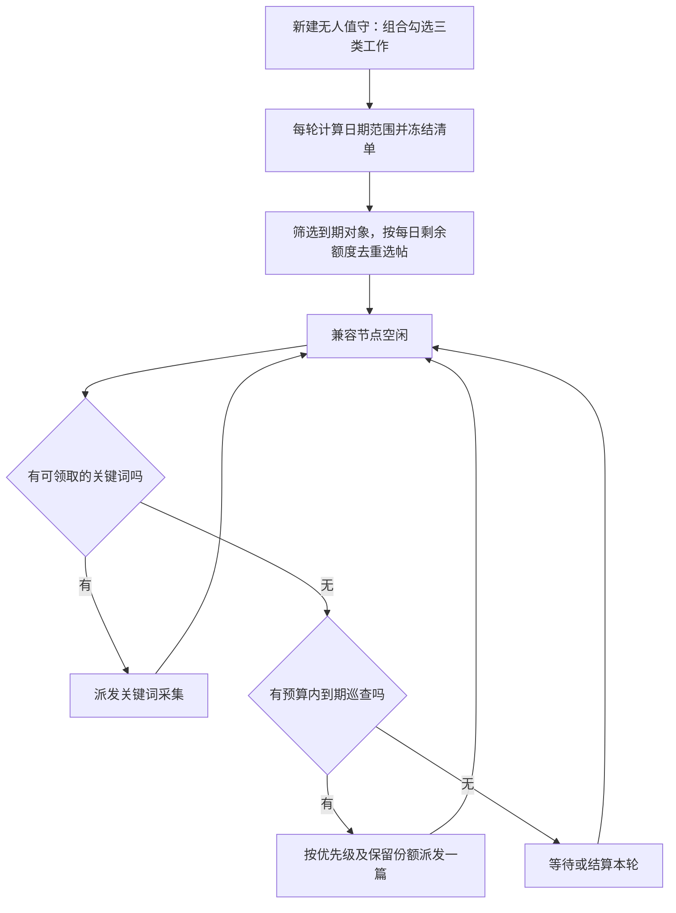

# 无人值守组合采集与巡查：历史讨论及数据测算

当前确认方案见[无人巡检附带近7天负面巡查：v5](/Users/dulaidila/.gemini/antigravity/scratch/OnStarvoice-2/docs/无人巡检附带近7天负面巡查-确认方案-20260908.md)。客户已确认在原无人巡检中增加勾选项，仅看前7天负面并轮转。下文v4保留为历史讨论与测算依据，其中30天跟踪、历史抽查及固定每日配额均不作为当前默认要求。

历史版本：讨论稿 v4 · 2026-09-08 · 以现有内容处理状态驱动复查，结合变化、到期和预算  
用途：产品与研发评审；本次仅形成方案。  
依据：当前工作区代码（分支 `codex/architecture-modernization-p2eh-hosted-runner`，基于提交 `8477715`），未核验为生产部署版本。

## 1. 需求理解与建议

客户希望每次日常巡检同时回答三个问题：今天出现了什么新内容，已有负面内容发生了什么变化，人工关注的内容有没有新动态。

在现有“新建无人值守”入口中，增加可组合勾选的“关键词采集、负面巡查、关注内容复查”。客户配置一次时间、各模块规则和执行节点，每次到点生成一个运行批次，按所选组合自动完成工作。保留“无人值守”的产品名称与原入口。

执行顺序以关键词优先：本轮先派发关键词采集，节点释放后，在没有可领取关键词时接续负面巡查和关注内容复查。其他节点仍可继续关键词采集，无需等待所有关键词结束。选帖先读取现有内容处理状态，决定是否排除、采用何种基准频率，再根据可靠变化、到期时间与每日额度安排访问。

需求已确认的是“组合勾选、关键词优先、空闲节点接续巡查、范围有规律、负面不能每天全量回访”，以及“直接把内容里已有的处理状态考虑进去”。用户提到的飞书表对应现有“负面-飞书表”，不表示本次要读取、写入或同步飞书。具体频率、预算和增长阈值均为试运行建议，尚未用实际数量与节点耗时校准。

## 2. 已有能力与缺口

| 业务 | 当前工作区已有能力 | 整合需要补充 |
| --- | --- | --- |
| 无人值守关键词采集 | 云端定时计划、运行批次、关键词工作项；另有设备本地计划 | 一个云端计划支持三类业务；每轮自动生成巡查对象 |
| 负面巡查 | 筛选已有负面帖子，逐帖刷新详情和互动，评论与博主数据可选 | 将手工筛选改为可保存的规则，并在每轮自动解析 |
| 关注内容巡查 | 人工关注具体帖子，从关注清单创建巡查 | 持续读取当前关注清单，自动纳入后续轮次 |
| 执行与结果 | 关键词、负面、关注工作项已有云端领取能力；内容时间线可汇总两类巡查 | 同帖去重、多来源归属、分模块状态、本轮总览 |

“关注内容”指已关注的具体帖子，与“关注博主扫描”和“官方账号评论巡查”是不同业务；后两者不在本次首期范围。

当前手工巡查候选最多返回100条，负面按发布时间、关注按关注时间排序。自动计划需要完整识别跟踪对象及到期对象，再从中按预算选帖；完整识别不等于每天逐帖访问。当前底层支持三类工作项，但缺少每帖下次复查时间和预算调度。

## 3. 客户如何使用

保留“新建无人值守”入口，依次配置：

1. 基本设置：计划名称、每天或指定日期、开始时间、时区，沿用已有随机偏移能力。
2. 任务组合：以复选框选择“关键词采集、负面巡查、关注内容复查”，至少选一项。建议沿用原有关键词默认勾选，客户按需添加两类巡查，不静默扩大工作量。
3. 巡查策略：默认“按处理状态复查”，显示现有8种状态的参与开关与建议频率；客户确认主题/平台、入池与跟踪范围、每日额度，可调整状态频率。使用已有优先级表示重点，不另建一套处理状态。
4. 执行节点：采用云端节点池；允许池内只有一个节点。按平台和功能能力检查覆盖情况。
5. 预览与保存：分别展示历史总量、正在跟踪、今日到期、预算内计划执行、预计延期数量，以及节点覆盖。入池日期和本轮选帖均可解释。确认区固定说明“先执行关键词，空闲节点接续巡查”。

配置示例：

| 配置项 | 示例 |
| --- | --- |
| 任务组合 | ☑关键词采集　☑负面巡查　☑关注内容复查 |
| 运行时间 | 每天09:00 |
| 关键词采集 | 沿用已配置的关键词、平台及采集设置 |
| 负面巡查 | 本计划关键词关联内容；近7天首次识别的负面入池；先按现有处理状态排除或定频，再结合变化调整 |
| 关注内容复查 | 所选平台内关注清单，遵守同一处理状态规则；关注本身不自动覆盖排除状态或强制每日复查 |
| 巡查额度 | 示例：每天最多200篇，并设节点时间预算；数字由试运行吞吐校准 |
| 执行方式 | 关键词优先，空闲节点接续巡查 |

关键词模块保留原有排序、时间范围、条数与详情增强设置。负面和关注模块默认刷新正文、互动与页面可访问状态；附加评论和博主数据分别设置，避免普通巡检耗时不可控。附加评论代表按采集规则取得当前可见评论，不承诺平台全部评论或全部新增评论。

已有计划不能因界面升级自动扩大采集范围。提供“加入负面与关注巡查”，展示新工作量，保存后从下一轮生效。原有单次负面巡查和单次关注巡查保留，供临时补查。

## 4. 每轮检查哪些对象

| 模块 | 默认对象 | 更新规则 | 主要结果 |
| --- | --- | --- | --- |
| 关键词发现 | 计划中的关键词与平台 | 按当轮采集设置搜索 | 新增内容、已识别负面、待分析内容 |
| 负面复查 | 跟踪池中已到复查时间、满足资格且预算可覆盖的帖子 | 新内容入池；成功观察后更新频率与下次到期时间 | 互动变化、正文变化、页面状态、可选评论 |
| 关注内容复查 | 当前关注清单中按所设频率已到期的帖子 | 关注关系决定对象，频率决定今天是否执行 | 关注帖变化及可选评论 |

### 4.1 直接复用现有处理状态

已核对前端状态选项、后端校验和数据库约束：现有状态来自`record_triage.status`，以下中文名称直接沿用。建议在无人值守配置中给这些状态设置是否参与及复查频率，避免客户重复维护另一套业务状态。

| 现有处理状态 | 已有字段值 | 建议默认规则 | 业务解释 |
| --- | --- | --- | --- |
| 待处理 | unhandled | 每24小时到期，优先于已处理普通内容 | 尚未完成处置判断，需要观察后续变化；仅对满足相应巡查候选资格的内容执行 |
| 已回复 | replied | 每3天；回复后仍在升温则每24小时 | 回复是已做动作，不自动等于风险结束 |
| 已复核 | reviewed | 连续稳定后每7天；缺变化证据先维持普通观察 | 已经看过和研判过，是否降频仍需结合变化 |
| 已复核-非监控内容 | reviewed_non_monitor | 默认不进入自动负面与关注复查 | 尊重客户已经做出的范围判断；保留记录与排除原因 |
| 已不可见 | unavailable | 暂停常规复查 | 保留历史；如客户需要核对是否恢复可见，可另开低频可见性复核，不自动判永久删除 |
| 负面–隐私设置无法触达 | privacy_unreachable | 继续按普通负面频率；不因该状态单独停查 | 现有定义是内容仍可见、因隐私设置无法直接联系，与页面无法访问不同 |
| 负面-飞书表 | negative_feishu | 默认每3天；重点或升温时每24小时 | 已记录客户的飞书表号，降低平台重复回访频率；不推断飞书上的事项已经解决 |
| 负面-冷处理 | negative_cold | 有稳定证据后每7天；近期无对比证据先补观察，升温时每24小时 | 冷处理表示处理选择，不能把“暂不回应”自动解释为无变化 |

以上频率为方案建议，可由客户按状态统一调整。状态更改仍由原有内容页面维护；自动巡查只调整执行频率、记录变化提醒，不把冷处理自动改成待处理、不改飞书表号、不改人工归档。

日常计划中“每天、每3天、每7天”按计划时区的自然日批次排期，避免用“上次09:20完成＋严格24小时”导致错过次日09:00批次。文中24/48小时是频率量级表达；日常排期使用每日/隔日及错峰分组，高频小时计划才单独定义严格间隔。同一天早晚两轮共享到期信息与额度。

处理次序为：既有候选资格与客户范围 → 当前处理状态排除 → 已有高/紧急优先级及可靠升温判断 → 状态基准频率与稳定降频 → 到期判断 → 每日预算。人工高/紧急优先级可提高可巡查内容频率，但不自动越过非监控或已不可见状态。

关注是独立入选理由，不重置已有处理状态：同一帖若已关注又为冷处理，默认仍按冷处理频率；若已关注又标非监控，默认排除并在预览提示冲突。客户需要恢复时通过原有状态切换或明确计划例外处理，不能因旧关注关系静默恢复。

当前两类巡查候选查询没有读取`record_triage.status`来决定频率或排除，接入时需要按租户和record_id关联该表，缺失行按现有口径视为待处理。读取状态不会把普通正面内容自动纳入负面候选；处理状态与情感结论冲突时单列提示，避免未经明确规则混用。

### 4.2 状态基础上的变化与年龄调整

处理状态先决定业务基准，年龄与变化用于细化仍需巡查对象。下表适用于普通观察、无明确状态低频规则的对象，不能覆盖上一节的排除状态；一旦出现可靠升温，可把可巡查的低频状态暂时加频而保留状态原值。所有数值为首期试运行起点。

| 对象层级 | 建议频率 | 进入与退出规则 |
| --- | --- | --- |
| 人工重点、确认需持续处置的内容 | 默认每24小时到期；更短间隔须单独配置并具备相应运行次数与容量 | 不因互动低或帖子变旧自动降频；人工解除重点后回到普通策略 |
| 新发现负面，进入跟踪后的前3天 | 每24小时 | 新发现的旧帖同样获得观察机会；当前首次完整采集不立即重复访问 |
| 持续升温、正文发生实质变化 | 保持每24小时；从稳定层重新升级 | 按最新有效前后快照及人工判断升级；不依赖帖子仍在近7天内 |
| 第4—7天，已有连续稳定证据 | 每48小时 | 至少两次有效可比观察均无明显变化，才允许降频 |
| 第8—30天，持续稳定 | 每7天 | 未达到稳定条件的帖子保持原频率；到期日错开，避免集中同一天 |
| 超过30天的稳定历史内容 | 退出常规高频池，进入历史轮查 | 在另行配置的历史范围内轮流抽查，例如近90天；再升温或人工关注可重新激活 |

“每天到期”是目标频率，实际执行受计划运行时间、关键词优先和容量约束；逾期必须可见。仅每日运行一次的计划不能兑现每6小时复查。

新负面入池建议按“首次识别为负面”计算近7天，入池后默认跟踪30天；首次发现时间、发布时间分别保留。首次判负时间须不可被后续AI重跑覆盖，不能直接用最近采集、最近更新时间或最后一次AI标注时间。现有历史数据缺少首次判负时间时，只在客户明确的初始化范围内加入，标为历史初始化，不能把全库都当成今天新发现。

近7天是推荐模式的入池窗口，30天是普通跟踪期限，两者在界面分别说明。历史轮查范围也是单独的显式配置；未启用历史轮查时，不自动扩大客户范围。若客户选择“严格仅查近7天”，到期、升温规则也不能越过该范围，系统显示被范围排除的重点或活跃帖，供客户调整规则。

人工关注表示需要跟踪，不自动等于严重风险，也不自动覆盖状态频率。优先使用已有`record_triage.priority`的high/urgent表示重点；对重要质量、安全等指控，即使互动少也不因年龄自动降频。首期不假设已有可靠自动风险评分，也不要求新增“重点”处理状态。

### 4.3 怎样判断升温或稳定

- 只有成功入库、来源可确认的前后快照可以参与判断；没有回访、验证码、同步失败、缺失指标都不等于稳定。
- 互动变化同时看绝对增量、相对增幅和两次观察的时间间隔。避免把1条评论变2条的100%增长等同于大规模升温，也避免只看累计点赞而忽略近期变化。
- 首期可以配置简单阈值。例如同平台每24小时折算评论增量至少10且增幅至少20%，或评论绝对增量达到50，进入升温候选；这些数字只是便于试跑的规则示例，需按客户及平台校准，不能当作风险等级。
- “连续稳定”建议要求至少两次有效可比观察且跨越至少24小时，没有超过配置阈值的互动变化，也没有实质正文变化；缺关键字段时维持原频率并标记待判断。阈值附近不在两档之间频繁跳动。
- 首期默认轻量复查正文、页面状态与互动指标。评论补采保留客户开关；对升温或人工重点可建议增加评论采集，但必须计入预算。已明确要求评论的任务不能为了省时静默跳过。

### 4.4 历史内容怎样避免永久漏看

旧帖重新升温往往只有再次访问后才能知道。建议把每日巡查预算的10%留给稳定和历史内容，按最久未检查、平台和主题分组轮流选择，保存轮转游标；同一批未轮完前不总重复抽到相同帖子。关键词发现拿到可信新数据或人工重新关注时，也可重新激活。

轮查只能降低长期盲区，无法保证未访问期间没有变化。假设历史轮查范围有3000篇、每天只有20个访问名额，完整轮转至少需要150天；如果客户要求30天至少回看一次，理论上至少需要100个成功访问名额/天，再加失败余量。系统应展示预计轮转周期，不能同时承诺低预算和全量短周期覆盖。

### 4.5 可选的严格滚动日期规则

客户需要严格按日期检查时，可选择此模式替代推荐分级跟踪范围；同样只派发到期项，并受每日预算限制。包含独立的“时间依据”和“相对范围”，与关键词搜索的时间筛选分别保存：

- 时间依据：建议默认“内容发布时间”；可选“首次采集时间”。不能用“最近采集/更新时间”，否则每次复查都会刷新日期，使旧帖子不断重新进入近期范围。
- 相对范围：最近7天、14天、30天或自定义天数；另提供“上一自然周”。“最近7天”和“上一自然周”使用不同名称，不统称上一周。
- 计算锚点：本轮云端生成批次时固定开始时间T。最近N天采用[T−N天, T)；上一自然周采用计划时区的上周一00:00至本周一00:00。
- 日期预览：例如9月8日09:00开始，近7天范围为9月1日09:00至9月8日09:00之前；9月9日09:00的一轮自动变为9月2日09:00至9月9日09:00之前。
- 本轮一致性：所有节点共用冻结的时间边界和候选清单，不按各自领取时间重新查询范围。午夜之后接续的节点仍执行原轮次清单。
- 动态退出：内容超出滚动窗口后不再纳入该负面规则；若仍被人工关注，可继续由关注模块复查。

关注模块默认当前关注清单，也可配置相对时间范围或所选帖子；不强制沿用负面模块的7天窗口。每轮候选均在开始时计算并冻结。

### 4.6 对象与结果细则

- 负面范围使用系统已有的内容与关键词/主题关联，不在标题上做临时字符串猜测。筛选按租户权限执行。
- 关注是明确的人工意图：不要求帖子为负面，也不默认受关键词筛选限制。预览说明其覆盖范围，避免关注的非负面或竞品内容漏查。
- 沿用现有业务隔离：官方账号内容不纳入这两类巡查，博主资料不作为帖子候选；负面模块排除已判无关和误报待审核内容，关注模块保持人工关注的独立语义。归档不自动停止巡查。
- 首期直接复用现有处理状态和计划模块开关控制参与范围，不另造“非监控”“冷处理”“已转外部”等同义状态。人工归档与处理状态保持现有独立关系；是否另排除归档内容须在计划规则中明确。
- 已确认删除的内容退出日常重复访问并保留历史；暂时不可访问、验证码、登录失效分开记录，不能直接判定删除。
- 采用全部跟踪范围时，有有效原帖定位但缺发布日期的内容仍可复查；采用近期日期窗口时，无日期对象单列为范围待确认，不静默遗漏。临时不可访问项进入受限重试或人工处理，不能因为沿用手工筛选而永久消失。
- 每轮保存状态快照及选帖理由；领取前重新检查当前人工处理状态。若已改为非监控或已不可见，尚未执行项撤出并保留原因；正在执行的项按现有单项停止机制处理，保留已得结果。普通频率变更更新下次到期，计划配置修改仍从下一轮生效，不能因每轮快照冻结继续派发已被人工排除的帖子。
- 本轮新判负内容先加入跟踪登记并计算下次到期时间，不在同一轮立即重复打开；首次完整采集可作后续比较基线，但不冒充正式复查成功。AI尚未完成时显示待分析，不计为无新增负面。
- 推荐分级模式下，新发现帖子不会仅因发布时间将满7天而立即退出新发现观察期；严格日期模式则遵循客户边界，报告保留首次发现和超范围原因。运行中新增跟踪不改变已冻结的本轮派发清单。
- 配置了模块但没有候选，显示“本轮无符合内容”，属于正常结果；模块没有开启则显示“未启用”。

## 5. 同帖去重与执行顺序

同一租户、同一轮、同一平台的同一篇帖子，若同时命中负面和关注，只生成一个定向复查工作项，记录两个纳入理由。采集设置取两者需求的并集，例如任一模块要求评论，便采集评论；结果供两个业务视图引用。

业务覆盖数与实际执行量分别统计。例如负面 80 条、关注 30 条，其中 10 条重合，实际复查 100 篇；两个模块仍分别覆盖 80 条与 30 条。本轮总量不把这 10 条重复相加。

关键词搜索与逐帖复查是两种不同粒度的工作。普通重复采集不会自动成为正式巡查结果；首期不做复杂的跨任务结果复用。后续若要用关键词采集抵扣复查，必须同时满足当轮时间、采集深度、基线与结果快照配对等条件。

建议每个节点空闲时按以下固定次序判断：

1. 本轮有该节点兼容、未领取且可立即执行的关键词，优先领取关键词。
2. 无此类关键词时，从预算内已到期巡查中选取；优先人工重点、升温与新发现，但同时保留关注和历史轮查份额。
3. 同一帖的负面与关注需求合并，只有一份实际执行及预算占用；分别保留业务覆盖归属。
4. 全部可执行项已领走、但其他节点仍在运行时保持等待；所有项已有明确结算状态后结束本轮。

“节点空闲”指节点的当前采集执行已释放。已被其他节点领取且正在执行的关键词不阻止空闲节点开始巡查。若仍有待领关键词，默认继续优先关键词；关键词因平台不兼容、人工验证或重试冷却而暂不可领，也不阻止兼容的巡查任务接续。正在执行的巡查不被中途抢占，完成后再判断优先级。

例如4个节点执行6个关键词：起初4个节点各领1个；先完成的两个节点先领剩下2个关键词；之后又有节点空闲，即可开始负面巡查，此时其他节点仍可能在执行关键词。单节点同样优先领取当前可执行的关键词；关键词尚在冷却或等待人工处理时，可先做巡查，关键词恢复后在下一次空闲时再优先领取。若未勾选关键词，直接开始所选巡查。

巡查额度内采用可解释的顺序：人工重点先于普通对象，同层级到期越久越优先，再看最近可靠变化与新发现状态。为关注和历史轮查保留最低份额，避免负面一直占满空闲时间。某一份额没有可执行对象时可以借给其他类别；重点数量超出可用预算时明确显示重点逾期，不静默挤掉全部保留份额，也不突破总额度。

同一节点保持现有执行互斥。节点之间允许关键词与巡查并行，执行优先次序只影响下一项派发。负面复查不依赖本轮全部关键词和AI分析完成，某篇帖子失败也不阻塞其他可执行内容。

## 6. 工作量、超时和异常

每日实际派发只针对“今天到期且预算选中”的帖子。跟踪池仍须完整枚举并保存到期信息，不能直接把手工接口前100条当成全体。未到期属于按规则等待，已到期但未选中属于预算延期，二者分别统计。清单生成未完成时不能提前结算。

建议同时配置两个额度：每天最多复查多少篇，以及每天最多消耗多少节点分钟。按计划时区跨轮共享当日额度，并在租户层限制多个计划合计占用；节点每次访问的重试、附加评论都消耗时间预算。同帖双来源只占一个篇数名额，重试仍计实际成本。不能把4个节点各工作1小时误算成只用了1小时，实际为240节点分钟。

起步可用“70%到期负面、20%到期关注、10%历史轮查”的保留份额，比例是可调建议。先合并同帖，再将唯一执行项归入一个额度桶；双来源帖子优先计入关注桶，同时形成负面覆盖，绝不双扣。对应模块未开启或无到期任务时，空余额度可借用。实际调度按预计耗时加权，篇数比例只是方便客户理解的展示，不能假设不同平台、不同采集深度耗时一样。

举例：历史有5000篇，今天到期600篇，按测得空闲容量设每天最多200篇。若平均成本近似且各类供给充足，可先分配140篇到期负面、40篇关注、20篇历史轮查。剩余400篇显示延期，下一轮仍保留原到期时间；实际成功数另报。该示例说明预算规则，不代表当前客户的数据量或已经测得能完成200篇。

额度初值由各平台、各采集深度的实际耗时估算，用偏保守耗时和预留余量。分平台容量不可简单互换；某平台没有兼容节点时，其到期内容继续标明等待，不用另一平台空闲容量虚增覆盖承诺。关键词始终优先，巡查份额只分配关键词之后可用的容量；没有空闲容量时，巡查目标就会逾期，界面必须明确提示。

预览同时显示命中数、预计执行数和节点覆盖。预计耗时只能根据实际平台与采集深度的历史耗时估算；缺少样本则显示“暂无可靠估算”。

建议首期默认每轮最多运行12小时，截止后的同步与停止确认另给10分钟收尾；这两个值是方案建议值，试运行后根据实际工作量调整。等待节点、重试、等待同步均不能无限延长本轮。若另设数量上限，必须明确显示“符合范围 / 已纳入 / 已成功 / 未执行”，保留未覆盖对象及原因，不能把截断当作全量完成。

到截止时间停止新领取，并请求停止活动项。收尾后结算为“部分完成、需处理”；业务轮次结束与客户端停止确认分别记录。仍未确认停止的节点不得再领取新任务，旧attempt失效后不能覆盖接续结果，待确认恢复空闲才能回到节点池。下一轮可由其他兼容节点继续生成，避免一条挂起任务导致以后每天都被跳过。迟到回执仅进入原轮次核对并注明补到时间，不混入新轮次。

成功复查才按新层级更新下次到期时间。预算延期、失败或需人工处理不能被顺延成“尚未到期”；保留原到期时间，另用重试冷却避免连续占用节点。下一轮重新计算资格和预算，未选中的对象仍能被看到。严格日期模式下，移出窗口的未执行对象保留“逾期未查后超范围”记录。建议每项每轮最多自动重试2次，且受当日总成本限制；平台验证问题等待人工恢复。

| 情况 | 建议行为 |
| --- | --- |
| 某模块无内容 | 正常记录为空，其他模块继续 |
| 部分平台缺少节点 | 标明该平台待执行，其他有能力的节点继续 |
| 节点掉线/迁移 | 按执行模式回收可转交的未完成项；保留批次与其他节点，使用新 attempt 接续 |
| 验证码或登录问题 | 保留需人工处理状态；遵循现有平台限制，不借自动换账号绕过 |
| 一篇采集失败 | 有界重试；失败原因归属到该篇，其他项继续 |
| 页面暂不可访问 | 记录访问异常，不当作已删除或互动降至零 |
| 已确认删除 | 保存删除证据及历史，作为已核查的页面结果展示 |
| 结果未同步入库 | 显示同步待处理，不能因浏览器已读完而算成功 |
| 分析尚未结束 | 单列待分析数；本轮采集可结算，分析结果后续更新 |
| 上轮仍在执行而下轮到点 | 沿用不重叠规则，记录跳过及原因；多次跳过提示容量不足 |
| 系统恢复后错过时间 | 沿用调度器现有迟到/漏跑策略并展示记录，不突然补发多轮 |

## 7. 计划管理与结果展示

计划页展示：下次运行时间、任务组合、各处理状态的巡查规则、每日预算、今日已使用额度、到期/逾期数量与节点覆盖。本轮详情显示现有处理状态、上次巡查、下次到期及原因，例如“负面-冷处理，每7天，到期明日”或“已复核-非监控内容，本轮排除”。

本轮任务显示一张主卡，展开查看“关键词发现 / 负面复查 / 关注内容复查”。保留节点和执行明细作为下钻信息。综合进度以实际唯一工作项计算，同时单独列出关键词与帖子进度，不把混合百分比解释为预计剩余时间。

建议将执行状态与业务结果分开：运行中、等待节点、正在停止是过程状态；本轮结束后显示“全部完成 / 部分完成、需处理 / 已取消”。已开启模块无候选不算失败，已确认删除可算成功核查，但必须独立列出。待同步、失败、未执行不能用绿色完成掩盖；AI 分析状态另列。

如果没有到期内容，显示“本轮暂无到期复查”；如果存在到期内容但额度已用完，显示“本轮额度已用完，仍有X篇到期未查”，不能混为无内容。实际选择的清单完成与整个跟踪范围覆盖分开显示：例如“本轮200篇已执行；另有400篇到期延期”。

本轮结果应回答：新增了多少负面、待分析多少；今天到期多少、选中多少、成功多少、延期多少；重点有无逾期；哪些帖子升温或降频；关注与历史轮查分别覆盖多少；还剩哪些访问异常和同步问题。每篇保留“为什么今天查/为什么未查”的可读原因。

汇总指标基于本轮真实工作项与观察快照，并按运行批次ID限定范围。互动增量只能用保存的基线和本次结果配对；缺失数据标记“未测量”。现有周期负面报表取周期内每帖最后一次巡查，不等于该周期所有轮次增量之和；本轮结果不能直接套用最近7天聚合数。评论数增加不等于新增评论全部已采集，更不等于新增负面评论。

同帖命中两个模块时，两个模块均可展示，单帖时间线只形成一条本轮复查记录并标注两个纳入理由。负面业务报表只统计具有负面巡查归属的内容，关注了非负面内容不能污染负面报表。

操作含义需固定：

- 暂停计划：阻止未来生成新轮次，当前轮继续。
- 停止本轮：停止当前轮全部未完成模块，保留已采集结果，未来计划仍保留。
- 补跑未完成项：在本轮保留原工作项和结果归属，创建新的执行尝试；不重新采集已成功项。
- 修改计划：产生新版本，从下一轮生效；当前轮仍使用创建时的快照。

停止必须覆盖关键词与定向采集两条执行链。界面只有收到终态或明确显示未确认节点后，才能如实报告结果；不能仅凭“正在停止”或云端取消标记宣称浏览器已停止。

## 8. 技术落地建议

### 8.1 复用已有云端编排

沿用“计划模板 → 定时运行批次 → 工作项 → 执行尝试”的现有结构，为计划增加版本化模块配置。一个轮次由同一个调度入口生成，避免分别创建三个独立定时计划再拼接标题。

业务状态与重点直接读取`record_triage.status`和`record_triage.priority`，飞书表号读取现有`feishu_table_no`，不增加同义处理状态或外部同步流程。拟新增的是调度信息：状态到巡查策略的映射、首次判负/入池时间、层级与理由、稳定次数、lastSuccessfulPatrolAt、nextPatrolAt、冷却、轮转位置及每日额度。跨轮共享到期与额度，领取时重新校验人工状态并用事务防止重复派发或超额。相对范围与本轮具体边界独立保存。

当前已有记录与观察快照，但负面分析返回的highRisk仍为null，且现有增量工具存在缺值按0计算的路径。首期分级应基于人工重点及可靠的原始指标，补齐缺值/时间跨度校验，不直接把现有展示增量当成自动降频证据。

定向复查合并以平台内容身份为依据，保留可访问的完整原帖 URL；不可仅按标题或简化 URL 去重。工作项需保留 `purposes`（负面/关注，可同时存在）、规则版本、有效采集设置、基线及权威结果快照。唯一约束需落在租户、运行批次和内容身份上，重试复用同一项并增加 attempt。

结果关联需要补强：当前定向结果存在按“该记录在开始时间之后的最新快照”查找 observation 的路径，同轮关键词或其他任务采到同帖时可能错误配对。综合巡检必须通过工作项、attempt及采集请求的关联标识精确绑定本次入库快照，校验租户和内容身份；未得到精确回执时保持待确认，不能任取最新快照。旧任务历史仍按旧口径读取并标明可测量性。

现有 `negative_post` / `watched_content` 可保留为兼容执行类别，但不能承担唯一业务归属。混合对象选择哪个兼容执行类别，不得丢掉另一个 purpose。旧客户端按已有执行协议接收任务，新归属由服务端保存；是否可完全免升级需用实际客户端版本验证。

### 8.2 已识别的具体改造点

| 改造面 | 当前约束 | 建议 |
| --- | --- | --- |
| 计划创建与调度 | 创建、模板物化围绕关键词 | 扩展为模块化规则；允许只开复查模块；定时和“立即运行一轮”共用同一生成逻辑 |
| 候选服务 | 手工接口截断为100条、空候选报错；负面使用绝对发布日期，并排除page_unavailable | 每轮按保存的相对规则解析日期；按选定字段筛选，无该字段的对象单列；可分页恢复，空模块正常结算 |
| 弹性领取 | 已识别三种item_type，但无到期及预算选择 | 关键词优先；空闲时领取预算内到期巡查；加入重点优先、保留份额、并发预算预留、多purpose和节点互斥 |
| 巡查状态 | 现有候选主要按日期和互动门槛筛选 | 新增持久跟踪状态与nextPatrolAt；成功更新频率，失败保留逾期；支持历史轮查游标 |
| 处理状态接入 | 已有8种状态，但巡查候选未按它们调度 | 复用record_triage，按现有值映射排除/频率；领取前复核；自动巡查不改人工状态及飞书表号 |
| 平台选择 | 定向子任务使用 item 平台，关键词部分仍取父任务平台 | 综合父批次下统一按工作项平台派发，覆盖小红书与抖音混合情况 |
| 采集设置 | 关键词读取父级 planSnapshot，定向读取父级 captureSettings | 每项冻结有效模块设置，防止评论开关、平台设置等跨模块串用 |
| 同帖去重 | 不同巡查任务目前没有跨任务实体去重 | 在综合轮次生成时先合并负面和关注；以多purpose统计业务覆盖 |
| 统计与时间线 | 负面报表按任务 workflow 识别；内容时间线已有两类记录 | 支持工作项purpose与旧workflow双轨读取；一次结果多模块引用但不双算总量 |
| 停止与恢复 | 关键词、定向执行存在不同取消路径 | 一个本轮停止入口覆盖全部执行项，拒收失效attempt并展示未确认停止状态 |
| 节点生命周期 | 当前代码会取消所有引用已迁移/停用节点的计划 | 对弹性计划仅移除该节点；仍有节点时继续，暂缺覆盖时保留计划并提示补充节点 |
| 整轮无工作项 | 通用聚合器当前保持pending、0% | 候选解析结束且所有启用模块均为空时，明确结算为本轮无待巡内容 |

### 8.3 兼容原有计划

云端旧计划读取为仅开启关键词模块，原有行为不变。新建综合计划用新版本配置；现有计划经用户启用新增模块后才扩大范围。

设备本地无人值守计划需要明确迁入云端：读取并预览原规则，确认旧计划已禁用且无遗留活动执行，再启用替代云端计划。迁移中断应保留可恢复状态，不能让本地与云端同时在同一时刻重复运行。首期允许固定一个云端节点，但不另建一套设备本地综合调度逻辑。

迁移预览列出无法原样迁移的规则。过程显示“待停用旧计划 / 待启用云端 / 迁移完成 / 需处理”。旧节点离线、无法确认停用时，云端替代计划保持未启用。若旧计划已停而云端启用失败，保留原配置备份并明确提示当前暂停；提供“继续迁移”和“恢复旧计划”。恢复旧计划前，必须确认云端替代计划禁止生成新轮次，且不存在活动轮次、遗留执行或未确认停止的节点；仅暂停云端计划不够。两个恢复方向通过同一迁移记录互斥执行。

## 9. 建议交付顺序

首期必须完整覆盖“保存一次、每轮自动执行三类工作、得到统一结果”，可以分步骤开发，但不能只交付统一入口便宣称完成整合。

1. 规则与数据契约：无人值守组合、现有8种处理状态映射、跟踪池、分级与到期、已有优先级、每日预算、同帖归属。
2. 自动生成与调度：统一解析范围、层级及到期队列，按预算选帖；关键词优先、空闲接续、保留份额、停止与重试。
3. 页面与报告：统一创建/编辑、计划和本轮详情、分模块覆盖、单帖时间线和负面报表兼容。
4. 小范围验收：新综合计划先在明确范围试运行，核对每类对象及真实浏览器结果后，再逐个迁移旧计划。

首期即交付规则化分级、到期调度和每日预算，先试运行2周，再依据重点逾期率、各层级积压、每百次复查发现有效变化的数量、历史轮查发现升温的比例与节点成本调整参数。随后再考虑自动风险模型、跨计划精确结果复用与外部通知。

## 10. 验收标准

| 场景 | 通过条件 |
| --- | --- |
| 定时触发 | 一个计划只生成一个综合轮次，三模块按配置自动进入本轮 |
| 组合选择 | 新建无人值守可勾选任意非空组合，仅所选模块生成工作；旧计划不自动增加巡查 |
| 关键词优先 | 节点存在兼容可领关键词时先采关键词；无待领关键词时可巡查，不等待其他节点结束关键词 |
| 运行中恢复 | 冷却关键词恢复可领后，在节点下一次空闲时重新优先领取，不中断已经开始的巡查 |
| 滚动范围 | 两天的近7天窗口自动推进1天；上一自然周按计划时区计算；各节点共用本轮冻结边界 |
| 时间字段 | 按发布时间和首次采集时间可得到不同正确候选；复查刷新更新时间不改变原入选依据 |
| 手动立即运行 | 与定时使用相同候选、去重和结果规则，仍受不重叠保护 |
| 动态范围 | 新负面/关注在符合各自规则时入选；取消关注只移除该归属；严格日期模式移出窗口后不再入选，分级模式按已保存的跟踪期限执行 |
| 双重命中 | 本轮选中负面80、关注30、重合10时只执行100篇，业务覆盖分别为80与30，额度只扣100篇 |
| 分级与到期 | 新发现按期复查；两次有效稳定观察后才降频；可靠升温重新升级；无观测不等于稳定 |
| 每日预算 | 同日多轮共享额度；并发领取不超额；失败及评论采集计成本；不同平台按各自容量计算 |
| 保留份额 | 关注和历史轮查得到所设份额；无对应对象时借用；不足时公开逾期，不承诺全部覆盖 |
| 历史轮查 | 轮转位置可恢复，不长期反复抽同一批；显示预计全量轮转周期；重激活保留原因 |
| 统计口径 | 库存、跟踪、到期、选中、成功、延期分别可核对；额度用尽不显示全范围完成 |
| 大清单 | 超过100条时完整识别跟踪/到期对象；只将预算选中对象物化为执行项，重启不丢失延期状态 |
| 空模块 | 无负面或无关注时正常记为空；所有启用模块均为空且解析完成时，整轮正常结束 |
| 混合平台与配置 | 每项派给兼容节点；不同模块的评论和其他设置不串用 |
| 节点异常 | 单节点掉线不取消整个计划，旧attempt不能覆盖接续结果 |
| 停止 | 关键词与定向采集都收到停止；可证明终态或明确列出未确认节点，已有结果保留 |
| 补跑 | 只处理未完成项，原轮次仍可追溯，无成功项重复采集 |
| 数据真实性 | 同步未完成不记成功；无基线不显示零增量；验证码不标删除；待分析不记为无负面 |
| 报表一致性 | 综合总量、两类业务覆盖、负面报表与单帖时间线可逐项核对，非负面关注不污染负面统计 |
| 超时与积压 | 默认截止与收尾后如实结算；未确认停止节点禁领新任务；保留各模块未覆盖及跳过记录；跨轮不擅自延长日期范围 |
| 处理状态 | 非监控默认排除；冷处理/飞书表按配置降频；无隐私联系能力不等于页面不可见；状态与归档仍独立 |
| 人工状态保护 | 巡查加频不改变人工处理状态、优先级或飞书表号；排除状态不被旧关注或热点判断自动覆盖 |
| 运行中改状态 | 变为非监控/已不可见后未领取项不再派发；保存撤出原因；已执行结果不丢失 |
| 旧计划迁移 | 旧关键词行为不被静默改变；同一本地计划与替代云端计划不重复执行；失败后可互斥地继续迁移或恢复旧计划 |

## 11. 代码依据索引

以下为当前工作区证据，不代表已部署或已通过综合巡检验收：

- `web/admin/src/pages/dispatch/cloud-tasks/CreateTaskDrawer.tsx:25`：现有任务类型与执行方式。
- `web/admin/src/pages/workbench/TriageQueue.tsx:84`、`server/routes/triage.js:26`：现有8种处理状态、优先级及中文名称。
- `server/db/migrations/059_content_handling_statuses.sql`、`060_content_feishu_table_no.sql`、`064_content_privacy_unreachable_status.sql`：处理状态、飞书表号和隐私不可触达的业务定义。
- `web/admin/src/pages/dispatch/cloud-tasks/NegativePatrolTaskCreator.tsx:89`、`WatchedContentTaskCreator.tsx:42`：两类手工巡查配置。
- `server/routes/negative-patrol.js:41`、`:493`、`:564`：手工候选上限与筛选。
- `server/routes/negative-patrol.js:1006`、`:1970`：负面与关注复用弹性巡查创建。
- `server/services/capture-orchestration-scheduler.js:327`、`:518`：不重叠与本轮工作项物化。
- `server/routes/capture-cloud.js:4664`、`:4713`、`:4776`、`:4838`：三类工作项领取、排序和模块设置/平台处理。
- `server/routes/capture-cloud.js:2883`、`:6482`：当前快照关联和节点生命周期的改造边界。
- `server/services/negative-patrol-analytics.js:10`、`:19`、`:73`：workflow判定与基线增量。
- `web/admin/src/components/shared/RecordDrawer.tsx:1632`：内容详情汇总负面及关注巡查。
- `docs/negative-patrol-analytics-api.md`：负面统计和快照配对口径。

历史停止问题仅作为本稿验收边界的参考，未在本次复现或确认是否仍存在。

## 12. 方法依据与参数边界

网页复访调度需要同时考虑内容变化、重要程度与访问容量，而且多数变化只有再次访问后才可知。微软研究院的[Web crawl scheduling](https://www.microsoft.com/en-us/research/project/web-crawl-scheduling/)介绍了这些约束。本方案借用这一调度思路，加入客户重点和业务覆盖要求；上述3天、7天、30天、70/20/10比例及阈值均为本项目建议，未经客户数据验证，不是该研究给出的行业标准。

## 13. 按当前实际数据估算每日工作量

数据时间：2026-09-08中午，首次数据库核对时间12:58:55（Asia/Shanghai）。数据源为安吉星租户生产数据库的只读聚合查询，使用READ ONLY事务并设置查询超时；未修改数据、计划或派发任务。

范围：小红书＋抖音，全租户，尚未额外限定到某一计划的关键词。负面按现有情感、相关性、待审核误报、内容类型和原帖定位规则筛选，与人工关注取并集；同帖只计一次。排除已复核-非监控内容、已不可见，以及采集层记录为deleted/page_unavailable的内容。归档按本稿既定规则不自动排除。关注可以超出负面的日期窗口，但不能越过处理状态排除。

日均估算按状态基础频率计算：待处理/隐私不可触达每天，已回复/负面-飞书表每3天，稳定后的已复核/负面-冷处理每7天；已有high/urgent移入每日档，本次合资格对象中该档为0。尚未根据实际前后快照验证升温和稳定，因此这是低频规则生效后的基准日均，不是今天准确到期数或已完成数。没有使用不存在的首次判负/nextPatrolAt字段假造精确排期。

| 日期范围（均加上合资格关注并去重） | 当前可巡查唯一帖子 | 基准日均复查量 |
| --- | ---: | ---: |
| 最近7天发布 | 30 | 7.33，约8篇/天 |
| 最近30天发布 | 99 | 29.48，约30篇/天 |
| 最近30天首次采集 | 114 | 41.62，约42篇/天 |
| 全部历史 | 299 | 209.29，约210篇/天 |

推荐分级模式的真实入池时间是首次判负，目前不能用上述发布时间或首次采集时间等同替代。两种30天口径用于说明量级及范围选择，正式启用后由实际跟踪登记与到期表计算。

最近30天发布的99篇构成为：负面-飞书表76篇、负面-冷处理22篇、隐私无法触达1篇，因此基准为76÷3＋22÷7＋1≈29.48篇/天。平台分布为抖音53篇、日均16.24；小红书46篇、日均13.24。合资格关注仅1篇，已包含在并集中，无需再加一次。

若冷处理尚无稳定证据、初始化先按每日补观察，以上30天发布范围会暂时提高到约48.33篇/天；升温加频、新增入池和历史轮查另计。首轮若给99篇全部建立基线，工作量也不同于常态日均，应在每日预算内错峰初始化，不能同一天统一标到期后宣称未来每天仅30篇。

建议先用近30天发布范围试跑，常态预计约30篇/天，初始设置每日最多50篇（含所选关注及历史轮查），保留新增和补观察余量；这是一项预算建议，不代表已经验证可每天完成50篇。若选首次采集30天口径，基准接近42篇/天，余量更小。历史轮查仅在明确启用且配置了范围时占用总额度，不能在50篇之外另加隐性工作量。

全历史中有169篇合资格“待处理”均已归档；照每天规则会每天增加169篇。它们不能因未限定范围自动全部回到高频清单，也不能擅自改动其处理或归档状态。应先确定初始化范围或明确归档参与规则。

原有关键词另计：当前云端启用4个每日计划，每计划13个关键词，配置上为52个关键词执行项/天。帖子复查量不乘早晚运行次数。该数量只是计划配置，不代表当天52项均已执行成功，也未包含另行配置的设备本地计划。

补充容量证据：近14天已完成定向工作项中，抖音77项中位耗时约0.4分钟、小红书89项约0.2分钟，但失败/取消、等待、评论深度与关键词占用均会影响真实吞吐，因此不据此直接承诺完成时长。当前15个active节点中14个最近5分钟有心跳，也不等于14个节点都空闲或都支持所有平台。
